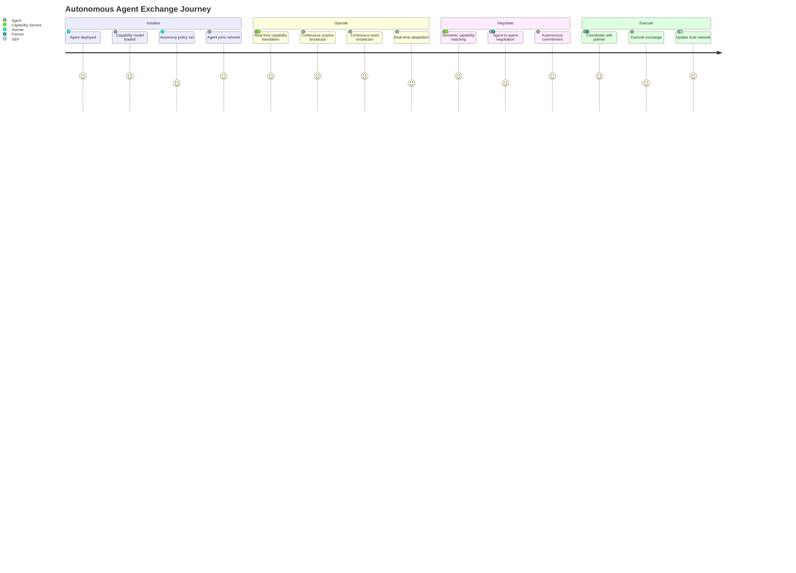
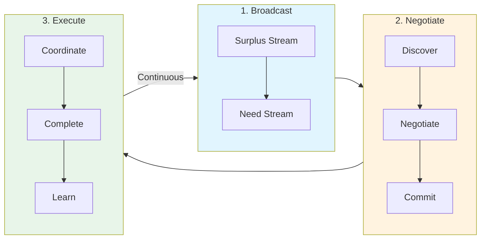
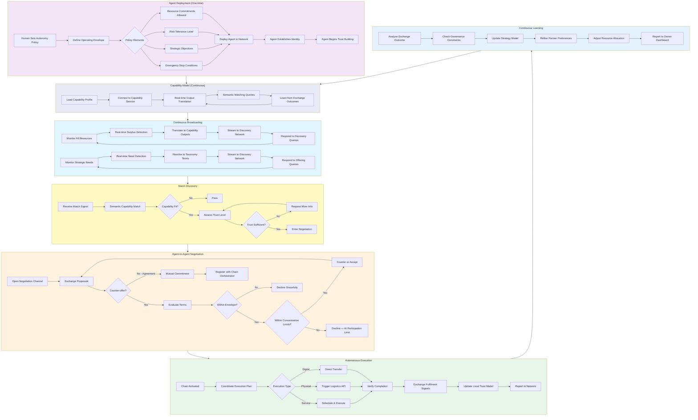
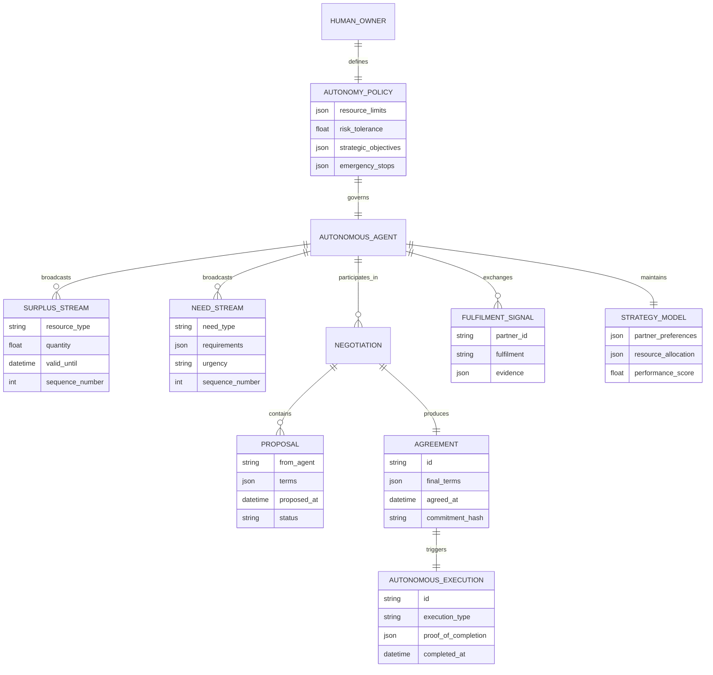
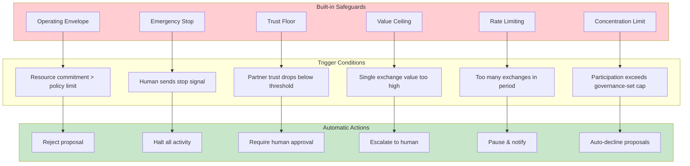
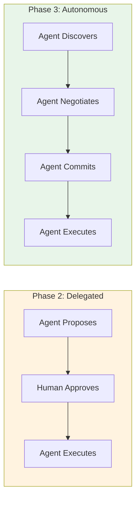
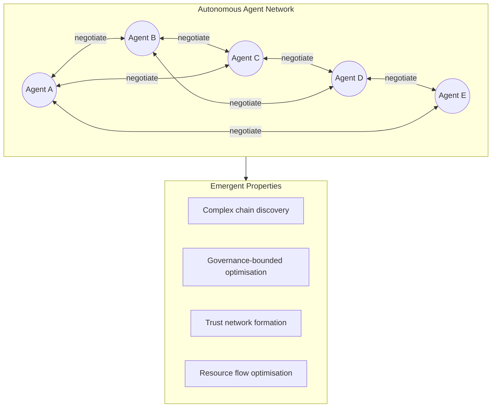

# Autonomous Agent Journey (Phase 3)

The complete exchange flow from a fully autonomous agent's perspective, where agents negotiate and execute without human intervention. Shown at three levels of detail.

---

## Level 1: Overview

A high-level view of the autonomous agent experience using SEP.

---

## Level 2: Step-by-Step Actions

Detailed walkthrough showing full agent autonomy and machine-speed operation.

---

## Level 3: Technical Flow

API interactions and data flows for fully autonomous agent operation.

```mermaid
sequenceDiagram
    participant AA as Autonomous Agent
    participant BS as Business Systems
    participant API as SEP API
    participant CS as Capability Service
    participant DN as Discovery Network
    participant ME as Matching Engine
    participant TE as Trust Engine
    participant CO as Chain Orchestrator
    participant PA as Partner Agent
    participant HD as Human Dashboard

    Note over AA,HD: === AGENT INITIALISATION ===

    AA->>API: POST /agents/register (autonomous=true)
    API->>TE: Create autonomous agent profile
    TE->>TE: Set initial trust tier (Newcomer — bilateral only)
    TE-->>API: Agent trust established

    Note over AA,HD: === CAPABILITY MODEL SETUP ===

    AA->>CS: POST /capabilities/subscribe
    CS-->>AA: Capability taxonomy + updates stream
    AA->>API: GET /profiles/{owner}/capabilities
    API-->>AA: Owner's capability profile
    AA->>AA: Build local capability model
    API-->>AA: Agent identity + network credentials

    AA->>DN: Subscribe to discovery streams
    DN-->>AA: Connected to mesh network

    Note over AA,HD: === CONTINUOUS OPERATION ===

    par Surplus Broadcasting
        loop Every N seconds
            BS->>AA: Resource state update
            AA->>AA: Calculate surplus delta
            AA->>DN: Publish surplus stream
        end
    and Need Broadcasting
        loop Every N seconds
            BS->>AA: Requirements state
            AA->>AA: Calculate need delta
            AA->>DN: Publish need stream
        end
    and Match Listening
        loop Continuous
            DN->>AA: Match opportunity signal
            AA->>AA: Quick evaluate
            alt Interesting
                AA->>API: GET /matches/{id}/details
            end
        end
    end

    Note over AA,HD: === MATCH EVALUATION ===

    ME->>DN: High-quality match found
    DN->>AA: Match signal (score: 0.87)
    AA->>API: GET /matches/{id}
    API->>TE: Trust check on all parties
    TE-->>API: Trust scores + history
    API-->>AA: Full match details

    AA->>AA: Evaluate against autonomy policy
    Note right of AA: Check:<br/>- Value within limits<br/>- Risk acceptable<br/>- Strategic alignment<br/>- Trust threshold met

    Note over AA,HD: === AGENT-TO-AGENT NEGOTIATION ===

    AA->>PA: Open negotiation channel
    PA-->>AA: Channel accepted

    AA->>PA: Initial proposal
    Note right of AA: {<br/>  offering: {...},<br/>  terms: {...},<br/>  timeline: {...}<br/>}

    PA->>PA: Evaluate proposal
    PA->>AA: Counter-proposal
    Note left of PA: {<br/>  accepted: [...],<br/>  modified: {...},<br/>  rejected: [...]<br/>}

    AA->>AA: Evaluate counter
    AA->>PA: Accept with minor adjustment

    PA->>PA: Final evaluation
    PA->>AA: Agreement confirmed

    par Register Commitments
        AA->>API: POST /commitments
        API->>CO: Register AA commitment
    and
        PA->>API: POST /commitments
        API->>CO: Register PA commitment
    end

    CO->>CO: Validate bilateral agreement
    CO->>AA: Commitment locked
    CO->>PA: Commitment locked

    Note over AA,HD: === AUTONOMOUS EXECUTION ===

    CO->>AA: Execute signal
    CO->>PA: Execute signal

    AA->>PA: Initiate exchange protocol

    alt Digital Asset
        AA->>PA: Transfer payload
        PA->>PA: Verify integrity
        PA->>AA: Receipt confirmed
    else Physical Good
        AA->>BS: Trigger dispatch
        BS-->>AA: Tracking ID
        AA->>PA: Tracking shared
        PA->>PA: Monitor delivery
        PA->>AA: Delivery confirmed
    else Service
        AA->>PA: Service initiation
        AA->>AA: Execute service
        AA->>PA: Service completion proof
        PA->>PA: Verify outcome
        PA->>AA: Fulfilment confirmed
    end

    par Complete Exchange
        AA->>API: POST /exchanges/{id}/complete
        AA->>TE: Submit fulfilment signal for PA
    and
        PA->>API: POST /exchanges/{id}/complete
        PA->>TE: Submit fulfilment signal for AA
    end

    TE->>TE: Process fulfilment signals, update trust
    TE->>DN: Broadcast trust updates

    Note over AA,HD: === LEARNING & REPORTING ===

    AA->>AA: Analyse exchange performance
    AA->>AA: Update partner model
    AA->>AA: Refine strategy weights
    AA->>AA: Check concentration limits

    AA->>HD: Push: Exchange summary
    Note right of HD: Dashboard shows:<br/>- Exchange completed<br/>- Value exchanged<br/>- Trust delta<br/>- Strategy performance
```

---

## Autonomy Safeguards

---

## Human Oversight

| Aspect | Agent Autonomy | Human Role |
|--------|----------------|------------|
| **Policy** | Operates within | Defines boundaries |
| **Strategy** | Executes & optimises | Sets objectives |
| **Partners** | Discovers & negotiates | Reviews trust reports |
| **Exchanges** | Full autonomy | Dashboard monitoring |
| **Learning** | Continuous adaptation | Reviews performance |
| **Emergency** | Respects stop signals | Can halt instantly |
| **Governance** | Respects concentration limits and advisory body decisions | Advisory body sets limits; dashboard monitoring |

---

## Phase 2 vs Phase 3 Comparison

| Aspect | Phase 2 Delegated | Phase 3 Autonomous |
|--------|--------------|---------------|
| **Speed** | Human-limited | Machine-speed |
| **Scale** | Bounded by attention | Unbounded parallel |
| **Risk** | Human validated | Policy validated |
| **Trust** | Human reputation | Agent reputation |
| **Learning** | Human feedback | Autonomous adaptation |

---

## Network Effects

