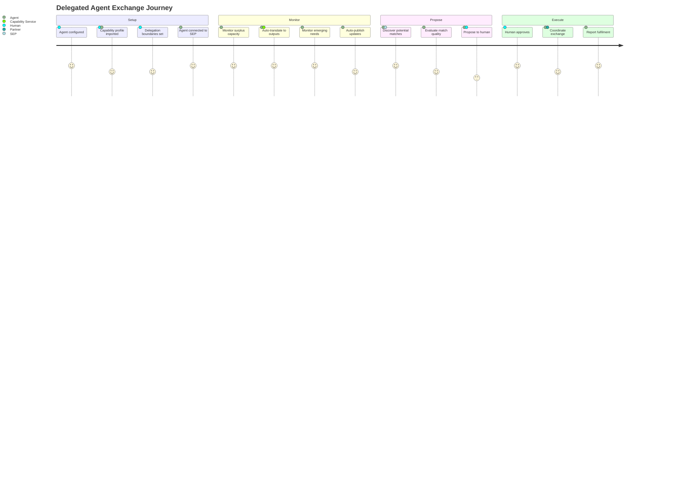
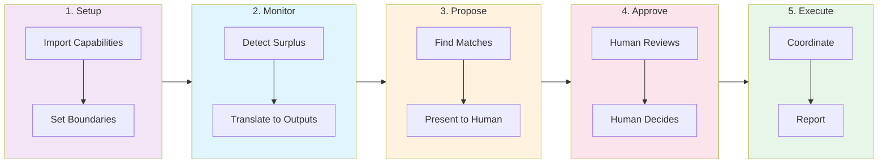
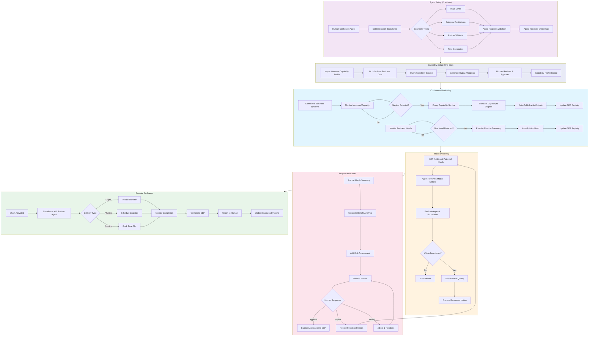
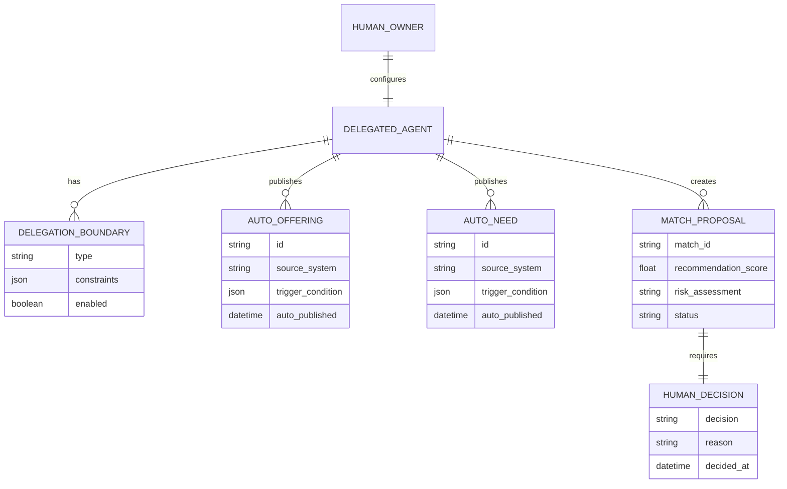
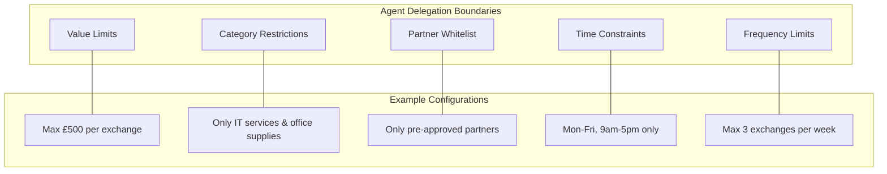
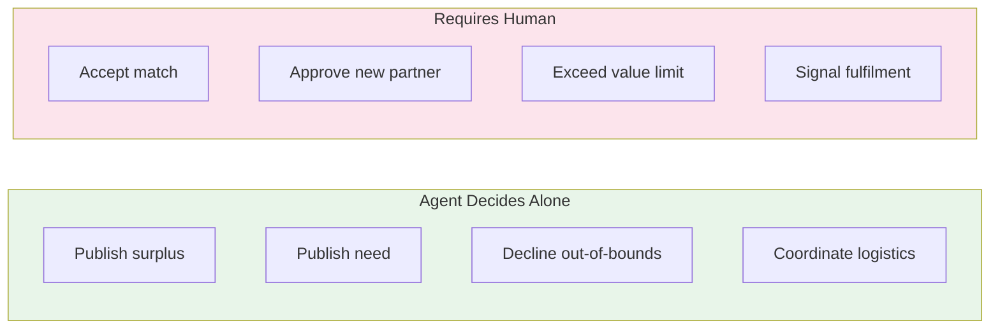

# Delegated Agent Journey (Phase 2)

The complete exchange flow from a delegated agent's perspective, where the agent proposes and humans approve. Shown at three levels of detail.

---

## Level 1: Overview

A high-level view of the delegated agent experience using SEP.

---

## Level 2: Step-by-Step Actions

Detailed walkthrough of each stage showing agent autonomy and human checkpoints.

---

## Level 3: Technical Flow

API interactions and data flows for delegated agent operation.

```mermaid
sequenceDiagram
    participant BS as Business Systems
    participant DA as Delegated Agent
    participant API as SEP API
    participant CS as Capability Service
    participant DS as Discovery Service
    participant ME as Matching Engine
    participant TE as Trust Engine
    participant CO as Chain Orchestrator
    participant H as Human Owner
    participant PA as Partner Agent

    Note over BS,PA: === AGENT REGISTRATION ===

    H->>DA: Configure delegation boundaries
    DA->>API: POST /agents/register
    API->>TE: Create agent trust profile
    TE-->>API: Agent trust initialised (Newcomer tier)
    Note right of TE: Starts at Newcomer tier<br/>(bilateral-only, 1 concurrent)<br/>unless human owner has vouch
    API-->>DA: Agent credentials + capability token

    Note over BS,PA: === CAPABILITY SETUP ===

    alt Import from human profile
        DA->>API: GET /profiles/{owner}/capabilities
        API-->>DA: Existing capability mappings
    else Infer from business data
        DA->>BS: Query staff skills, services offered
        BS-->>DA: Business context data
        DA->>CS: POST /capabilities/expand
        Note right of CS: Analyses business context,<br/>generates output mappings
        CS-->>DA: Suggested capability mappings
        DA->>H: "Review these capability outputs"
        H-->>DA: Approved (with adjustments)
    end
    DA->>API: POST /agents/{id}/capabilities
    API-->>DA: Capability profile stored

    Note over BS,PA: === SURPLUS MONITORING ===

    loop Continuous Monitoring
        BS->>DA: Inventory/capacity update
        DA->>DA: Detect surplus threshold
        alt Surplus detected
            DA->>CS: POST /capabilities/translate
            Note right of CS: "20hrs design" →<br/>["logo", "pitch_deck", ...]
            CS-->>DA: Translated outputs
            DA->>API: POST /offerings (with outputs)
            API->>DS: Index offering by outputs
            DS-->>API: Indexed (searchable)
            API-->>DA: Offering active
        end
    end

    Note over BS,PA: === NEED MONITORING ===

    loop Continuous Monitoring
        BS->>DA: Requirement update
        DA->>DA: Detect unmet need
        alt Need detected
            DA->>CS: POST /capabilities/resolve
            Note right of CS: "need a logo" →<br/>["logo_design"]
            CS-->>DA: Resolved taxonomy terms
            DA->>API: POST /needs (with resolved terms)
            API->>DS: Index need
            DS->>ME: Trigger matching
            ME-->>DS: Matches queued
            DS-->>API: Indexed
            API-->>DA: Need active
        end
    end

    Note over BS,PA: === MATCH EVALUATION ===

    ME->>API: Match found
    API->>DA: WebSocket: match notification
    DA->>API: GET /matches/{id}
    API->>TE: Get chain trust scores
    TE-->>API: Trust assessment
    API-->>DA: Full match details

    DA->>DA: Check delegation boundaries

    alt Outside boundaries
        DA->>API: POST /matches/{id}/decline
        API->>CO: Record decline
    else Within boundaries
        DA->>DA: Calculate recommendation score
        DA->>DA: Prepare human summary
    end

    Note over BS,PA: === HUMAN APPROVAL ===

    DA->>H: Push notification: "Match proposal"
    Note right of H: Summary includes:<br/>- What you give<br/>- What you get<br/>- Who's involved<br/>- Trust scores<br/>- Agent recommendation

    H->>DA: Review details

    alt Approved
        H->>DA: Approve
        DA->>API: POST /matches/{id}/accept
        API->>CO: Record acceptance
        CO->>CO: Check all parties
        CO-->>API: Chain status
        API-->>DA: Confirmation
        DA->>H: "Accepted, awaiting others"
    else Rejected
        H->>DA: Reject (with reason)
        DA->>API: POST /matches/{id}/decline
        DA->>DA: Learn from rejection
    else Modified
        H->>DA: Counter-proposal
        DA->>API: POST /matches/{id}/counter
        API->>CO: Route to other parties
    end

    Note over BS,PA: === CHAIN EXECUTION ===

    CO->>API: All parties confirmed
    API->>DA: Chain activated
    DA->>PA: Coordinate delivery

    alt Digital delivery
        DA->>PA: Transfer data/access
        PA-->>DA: Received confirmation
    else Physical delivery
        DA->>PA: Propose logistics
        PA-->>DA: Logistics confirmed
        DA->>BS: Schedule pickup/delivery
    else Service delivery
        DA->>PA: Propose time slot
        PA-->>DA: Slot confirmed
        DA->>BS: Block calendar
    end

    DA->>API: POST /exchanges/{id}/completed
    API->>CO: Update status
    CO->>TE: Exchange completed signal

    DA->>H: Exchange complete notification

    alt Exchange stalled
        DA->>H: Exchange appears stuck
        H->>DA: Flag as stuck
        DA->>API: POST /exchanges/{id}/stuck
        API->>CO: Initiate stuck workflow
    end

    H->>DA: Fulfilment signal (Yes/Partially/No)
    DA->>API: POST /exchanges/{id}/fulfilment
    API->>TE: Update trust scores

    DA->>BS: Update inventory/records
```

---

## Delegation Boundaries

---

## Human Checkpoints

| Stage | Agent Autonomy | Human Checkpoint |
|-------|----------------|------------------|
| **Setup** | None | Configure boundaries |
| **Monitoring** | Full - auto-detect surplus/needs | Review logs (optional) |
| **Publishing** | Full - auto-publish within bounds | Notification only |
| **Discovery** | Full - evaluate all matches | None |
| **Proposal** | Prepare recommendation | **Approve/Reject required** |
| **Execution** | Full - coordinate delivery | Notification only |
| **Completion** | Report to systems | Provide fulfilment signal (Yes/Partially/No) |

---

## Agent Decision Logic

