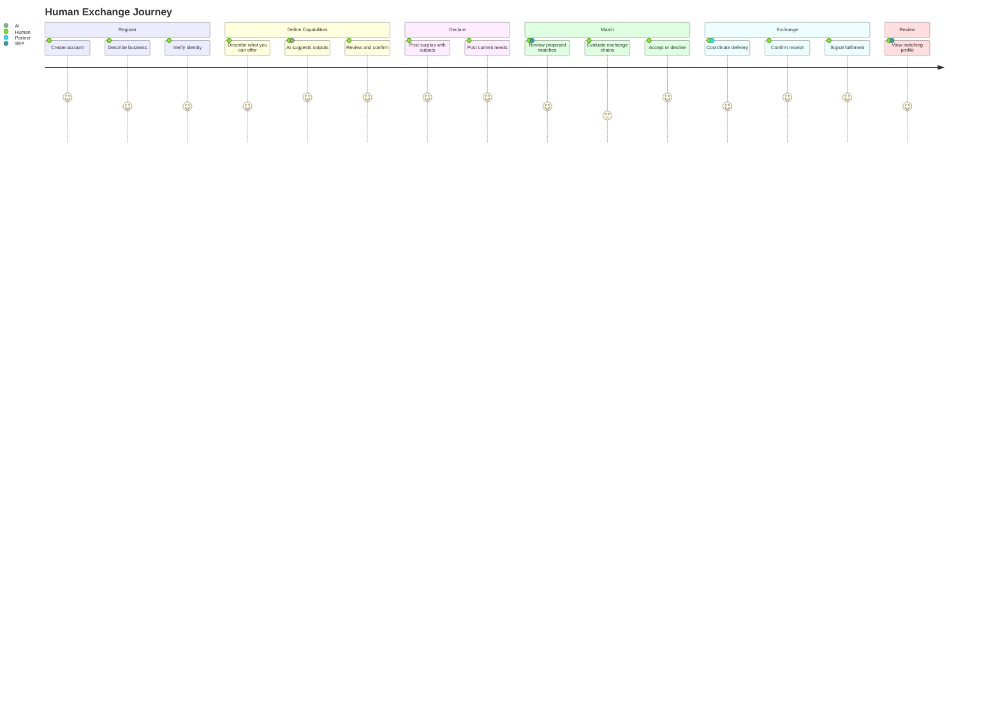
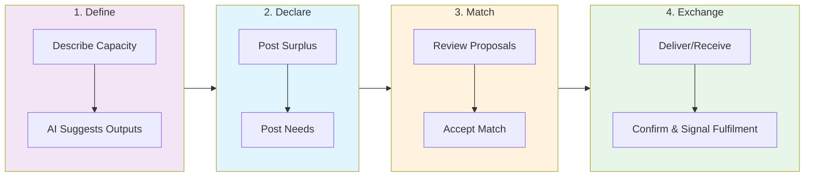
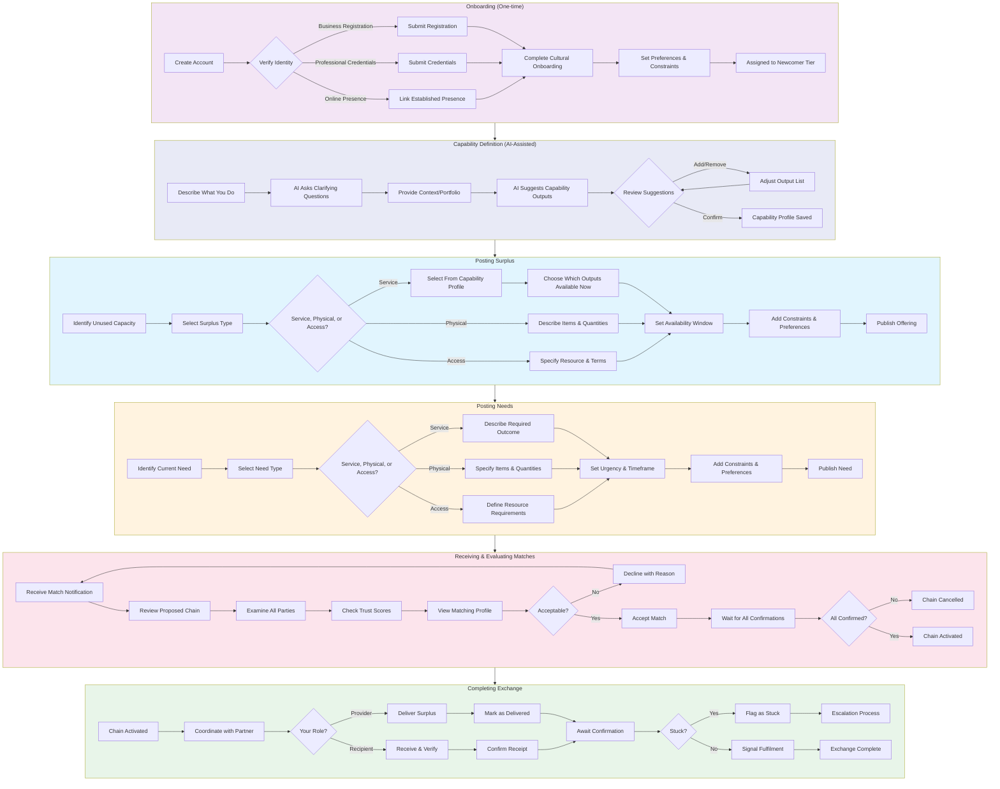
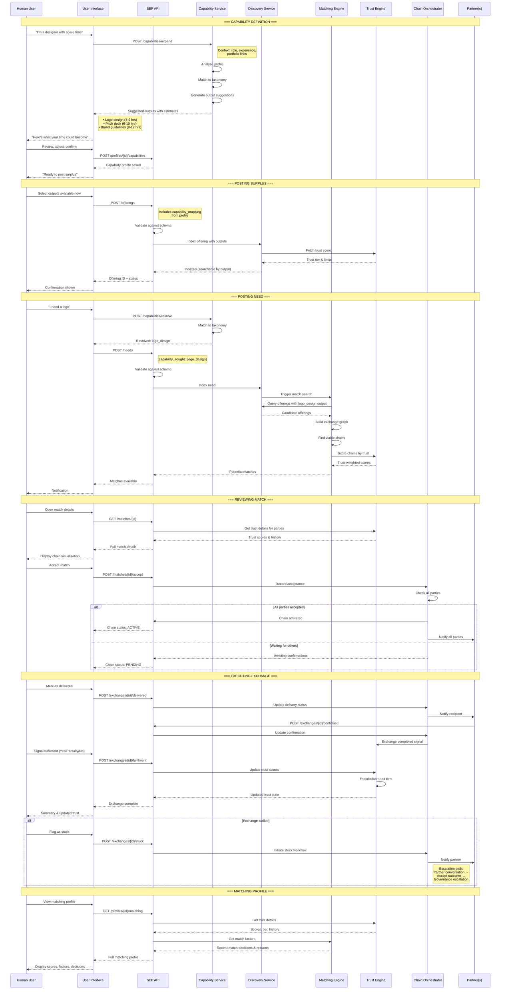
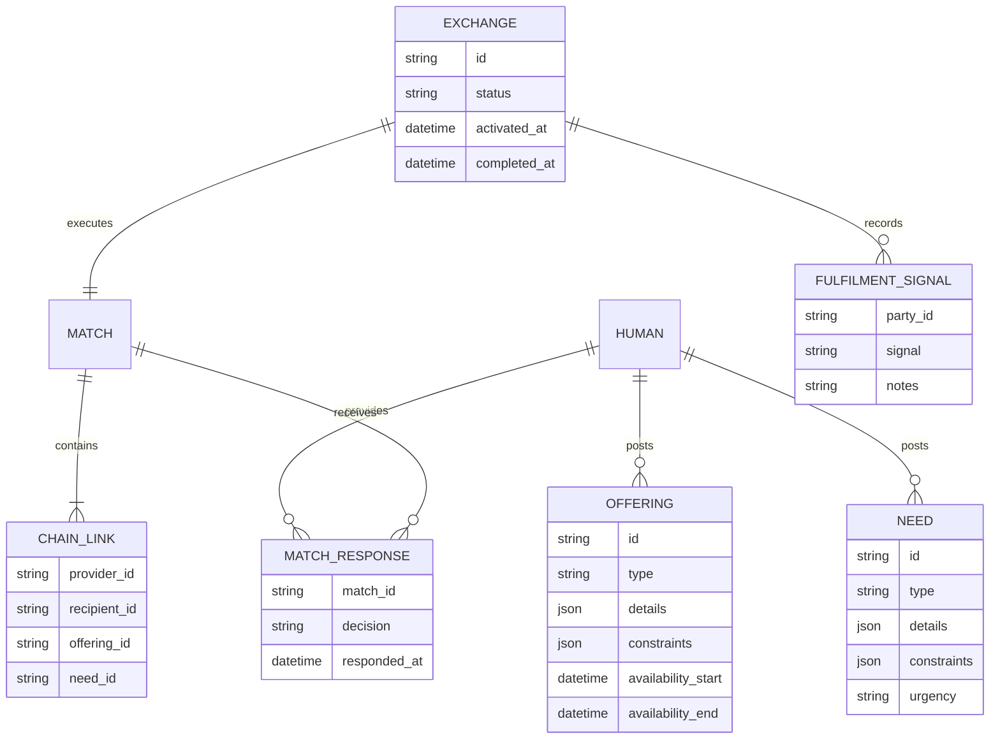
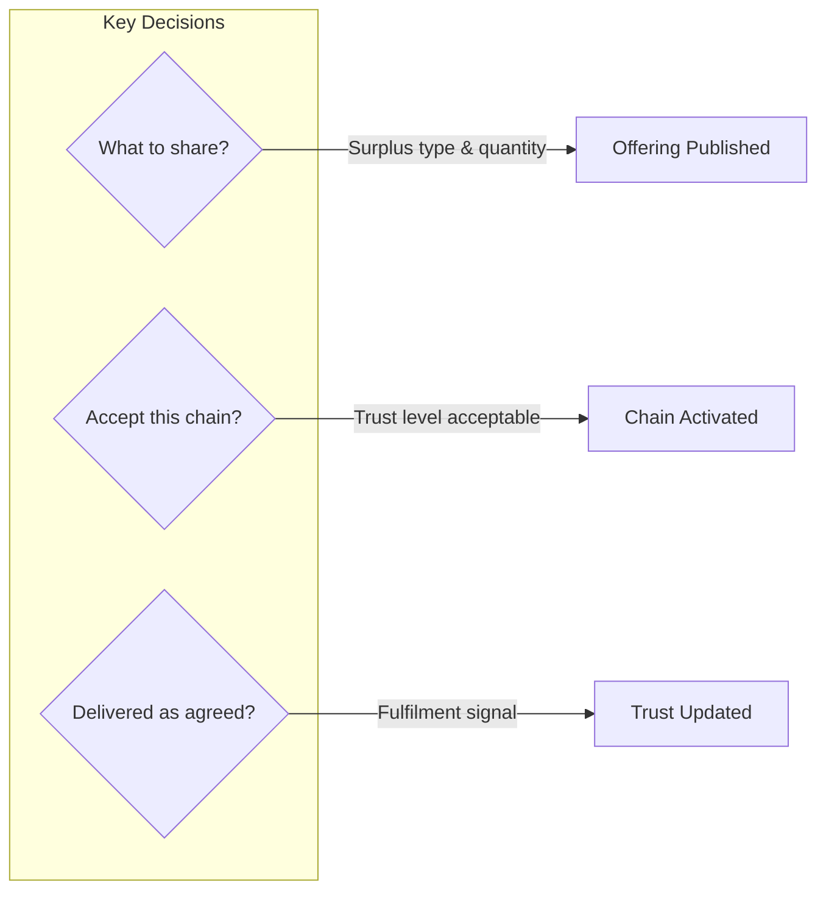

# Human User Journey

The complete exchange flow from a human participant's perspective, shown at three levels of detail.

---

## Level 1: Overview

A high-level view of the human experience using SEP.

---

## Level 2: Step-by-Step Actions

Detailed walkthrough of each stage with decision points.

---

## Level 3: Technical Flow

API interactions and data flows during the human journey.

---

## Key Human Touchpoints

| Stage | Human Action | System Support |
|-------|--------------|----------------|
| **Declare Surplus** | Describe what's available | Structured forms, type guidance |
| **Declare Need** | Describe what's needed | Templates, constraint helpers |
| **Review Match** | Evaluate proposed chain | Trust scores, party profiles |
| **Decide** | Accept or decline | Clear chain visualisation |
| **Coordinate** | Arrange delivery details | Contact facilitation |
| **Confirm** | Verify exchange completed | Simple confirmation flow |
| **Rate** | Signal fulfilment | Yes/Partially/No with optional notes |
| **Review** | View matching profile | Scores, factors, match reasons |

---

## Human Decision Points

