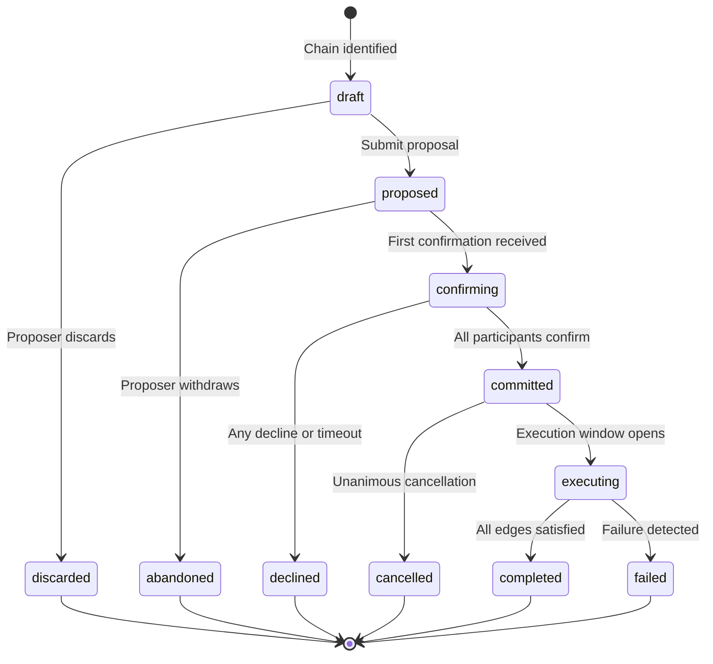
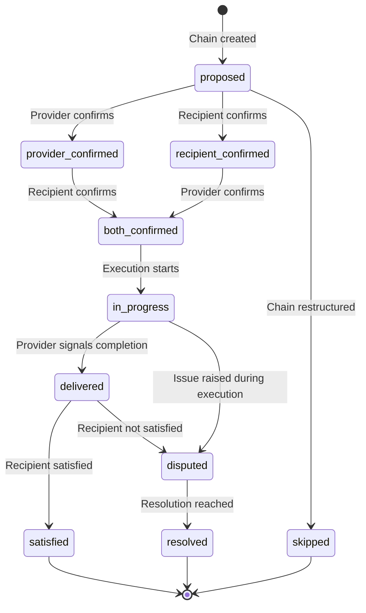
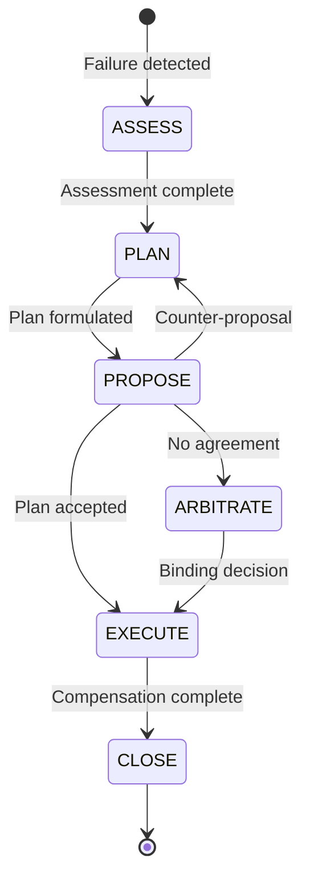
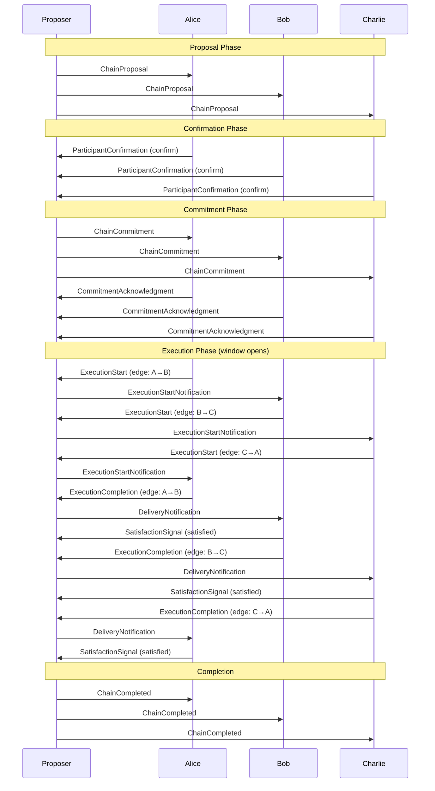
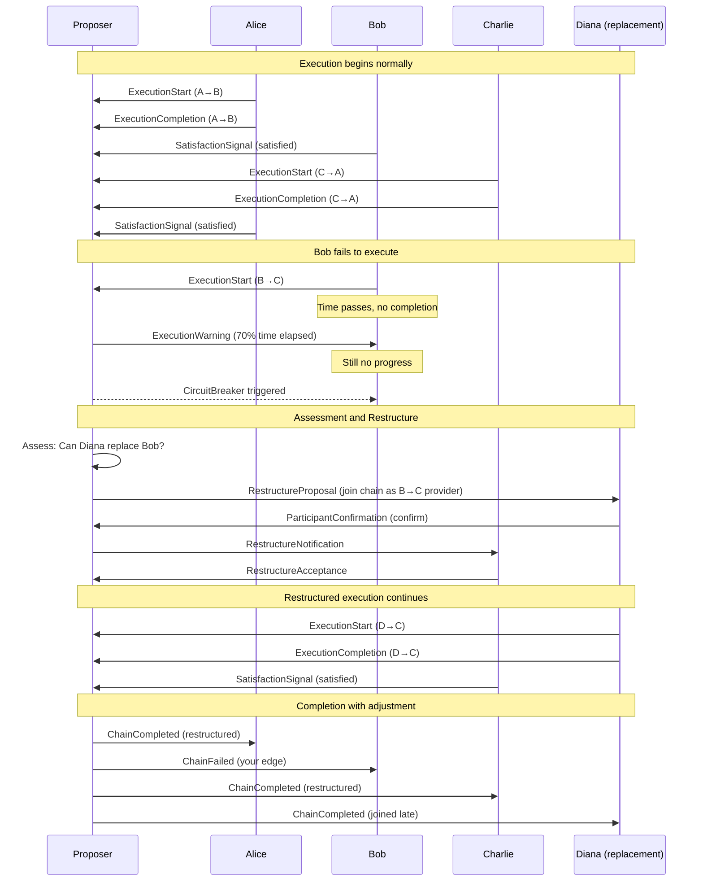
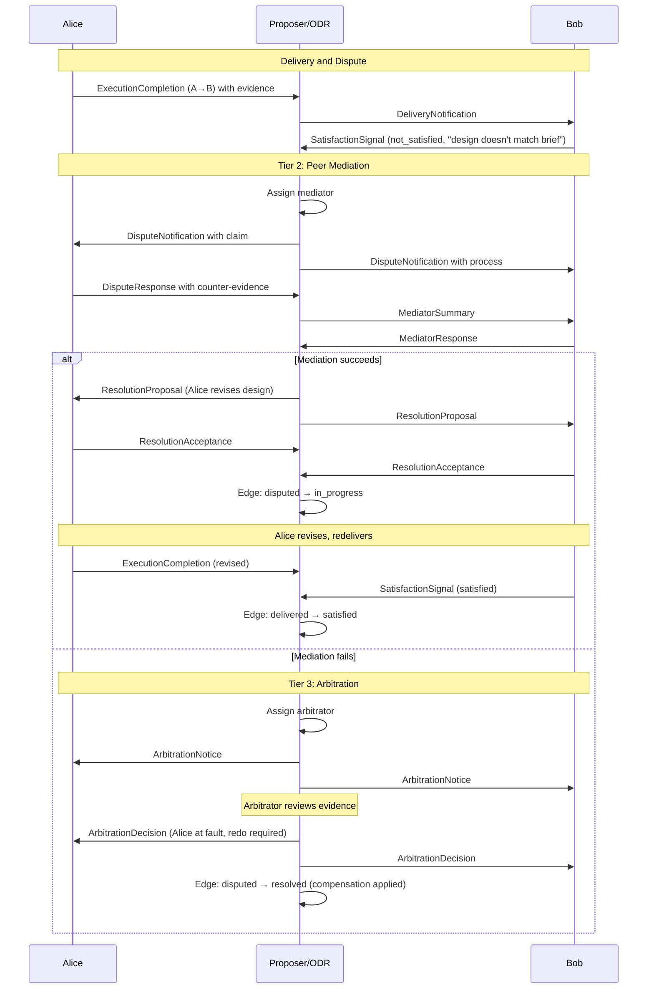
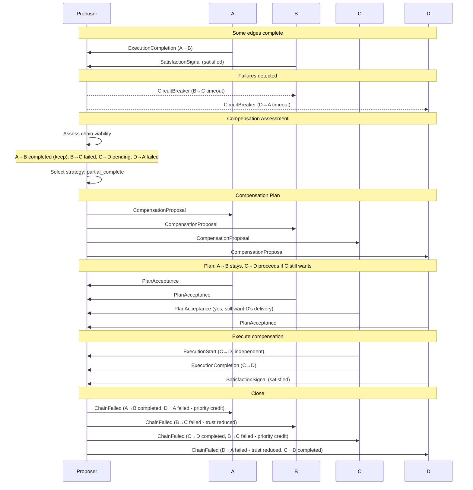

# Execution Protocol Specification

**Status**: Draft
**Version**: 0.1.0
**Last Updated**: 2026-02-05
**Authors**: SEP Working Group

---

## Abstract

This specification defines the execution protocol for Surplus Exchange Protocol (SEP) chains. It covers the complete lifecycle from chain proposal through completion or failure, including state transitions, timing constraints, failure handling, and compensation mechanisms.

The protocol draws on established patterns from distributed systems (Saga, Three-Phase Commit), traditional trade (Letter of Credit), and blockchain (multi-signature approval) while adapting them to SEP's unique requirements for long-running, multi-party exchanges without shared currency.

---

## Table of Contents

1. [Overview and Terminology](#1-overview-and-terminology)
2. [Chain Lifecycle](#2-chain-lifecycle)
3. [Edge Lifecycle](#3-edge-lifecycle)
4. [Timing Rules](#4-timing-rules)
5. [Failure Handling](#5-failure-handling)
6. [Compensation Mechanisms](#6-compensation-mechanisms)
7. [Example Sequences](#7-example-sequences)
8. [Security Considerations](#8-security-considerations)
9. [References](#9-references)

---

## 1. Overview and Terminology

### 1.1 Normative Language

The key words "MUST", "MUST NOT", "REQUIRED", "SHALL", "SHALL NOT", "SHOULD", "SHOULD NOT", "RECOMMENDED", "MAY", and "OPTIONAL" in this document are to be interpreted as described in [RFC 2119](https://www.ietf.org/rfc/rfc2119.txt).

### 1.2 Definitions

| Term | Definition |
|------|------------|
| **Chain** | A multi-party exchange cycle where all participants both give and receive, forming a closed loop (A gives to B, B gives to C, ..., N gives to A). |
| **Edge** | A single exchange within a chain, representing one participant providing value to another. |
| **Participant** | An entity (typically a business) involved in a chain, acting as both provider and recipient of different edges. |
| **Provider** | The participant delivering value in a specific edge. |
| **Recipient** | The participant receiving value in a specific edge. |
| **Proposer** | The entity (algorithm, broker, or participant) that identifies and formally proposes a chain. |
| **Confirmation** | A participant's binding agreement to participate in a proposed chain. |
| **Commitment** | The collective state achieved when all participants have confirmed; the chain becomes binding. |
| **Execution** | The actual delivery of value as specified in each edge. |
| **Satisfaction Signal** | A recipient's assessment of whether delivery met expectations. |
| **Compensation** | Actions taken to restore acceptable state when execution fails. |
| **Circuit Breaker** | A monitoring mechanism that detects execution failures before they cascade. |

### 1.3 Design Principles

This protocol is designed around the following principles:

1. **Explicit State Transitions**: Every state change has defined triggers, guards, and actions.
2. **No Ambiguous States**: Clear entry and exit conditions for each state.
3. **Recovery Paths**: Every failure state has a recovery or compensation path.
4. **Audit Trail**: All transitions are recorded for transparency and dispute resolution.
5. **Human Checkpoints**: Key decisions require human approval, not solely agent action.
6. **Idempotency**: All operations MUST be safe to retry.

### 1.4 Protocol Layering

This specification addresses the execution layer of SEP. It assumes:

- Chain discovery has identified a viable chain (see chain-discovery design document)
- Participant identities have been verified (see trust model documentation)
- Capability offerings have been validated against the capability schema

---

## 2. Chain Lifecycle

### 2.1 Chain States

A chain MUST be in exactly one of the following states at any time:

| State | Description | Terminal |
|-------|-------------|----------|
| `draft` | Chain being constructed; not yet formally proposed to participants | No |
| `proposed` | Chain formally submitted to participants for confirmation | No |
| `confirming` | At least one participant has confirmed; awaiting remaining confirmations | No |
| `committed` | All participants confirmed; chain is binding; awaiting execution window | No |
| `executing` | Execution window open; exchanges in progress | No |
| `completed` | All edges satisfied; chain successful | Yes |
| `discarded` | Draft chain abandoned before proposal | Yes |
| `abandoned` | Proposed chain withdrawn by proposer before any confirmations | Yes |
| `declined` | One or more participants declined or confirmation timed out | Yes |
| `cancelled` | Committed chain cancelled by unanimous agreement before execution began | Yes |
| `failed` | Execution failed; compensation complete or in final state | Yes |

### 2.2 Chain State Diagram



### 2.3 Chain State Transitions

#### 2.3.1 draft to proposed

**Trigger**: Proposer formally submits chain for participant confirmation.

**Guards**:
- Chain MUST have at least 2 edges
- Chain MUST form a closed cycle (every participant both gives and receives)
- All referenced offerings MUST be valid and available
- All participants MUST be eligible to participate (verified identity, not suspended)
- Chain MUST include valid timing parameters

**Actions**:
1. Generate unique `chain_id`
2. Create offering snapshots for each edge (preserve terms at proposal time)
3. Send `ChainProposal` message to all participants
4. Start confirmation deadline timer
5. Record `submitted` event in chain history

**Schema Reference**: See `exchange-chain.schema.json` for chain structure.

#### 2.3.2 draft to discarded

**Trigger**: Proposer abandons chain before formal proposal.

**Guards**: None.

**Actions**:
1. Record discard reason in chain history
2. Release any held resources

#### 2.3.3 proposed to confirming

**Trigger**: First valid confirmation received from a participant.

**Guards**:
- Confirmation MUST be from a listed participant
- Confirmation MUST be received before `confirmation_deadline`
- Participant MUST NOT have previously responded to this chain

**Actions**:
1. Record confirmation with timestamp
2. Update edge confirmation status
3. Send acknowledgment to confirming participant
4. Notify other participants of progress (OPTIONAL)
5. Record `participant_confirmed` event

#### 2.3.4 proposed to abandoned

**Trigger**: Proposer withdraws chain before any confirmations received.

**Guards**:
- No confirmations yet received
- Chain still in `proposed` state

**Actions**:
1. Send `ChainAbandoned` notification to all participants
2. Record `chain_abandoned` event with reason
3. Release any held resources

#### 2.3.5 confirming to committed

**Trigger**: Final required confirmation received (N-of-N).

**Guards**:
- All participants MUST have confirmed
- Current time MUST be before `confirmation_deadline`
- All offerings MUST still be available

**Actions**:
1. Reserve (lock) all offering capacity for this chain
2. Calculate final execution schedule if not already fixed
3. Send `ChainCommitment` message to all participants
4. Collect `CommitmentAcknowledgment` from all participants
5. Record `all_confirmed` event
6. Transition all edges from `proposed` to `both_confirmed`

**Commitment Requirements**:
- Implementations SHOULD use cryptographic commitments (hash of agreed terms)
- Implementations MAY require digital signatures from participants
- The commitment MUST include all material terms: edges, timing, offerings

#### 2.3.6 confirming to declined

**Trigger**: Any participant declines OR confirmation deadline passes with incomplete confirmations.

**Guards**: (varies by trigger)
- For decline: Valid decline from a listed participant
- For timeout: Current time >= `confirmation_deadline` AND not all confirmed

**Actions**:
1. Send `ChainDeclined` notification to all participants
2. Include reason: participant decline (with optional reason) or timeout
3. Release any provisional reservations
4. Record `chain_declined` event
5. Update trust metrics for non-responsive participants (OPTIONAL)

#### 2.3.7 committed to executing

**Trigger**: Execution window start time reached.

**Guards**:
- Current time >= `execution_window.start`
- Chain status = `committed`

**Actions**:
1. Send `ExecutionWindowOpen` notification to all participants
2. Start execution monitoring (circuit breaker)
3. Schedule health checks per `circuit_breaker.health_check_interval_hours`
4. Record `execution_started` event

**Note**: This transition MAY occur automatically at the scheduled time, or MAY require explicit triggering by the proposer/coordinator.

#### 2.3.8 committed to cancelled

**Trigger**: Unanimous cancellation request from all participants.

**Guards**:
- All participants MUST request cancellation
- No edge execution MUST have begun (all edges still in `both_confirmed`)
- Cancellation requests received within a reasonable window (e.g., 24 hours)

**Actions**:
1. Release all reserved offering capacity
2. Send `ChainCancelled` notification to all participants
3. Record `chain_cancelled` event with reason

**Note**: Partial cancellation (fewer than all participants) MUST NOT be allowed. Committed chains are binding.

#### 2.3.9 executing to completed

**Trigger**: All edges reach `satisfied` status.

**Guards**:
- Every edge status = `satisfied`
- No unresolved disputes

**Actions**:
1. Update trust metrics for all participants (positive signal)
2. Record `chain_completed` event
3. Send `ChainCompleted` notification with summary
4. Release capacity reservations (execution complete)
5. Archive chain for historical reference

#### 2.3.10 executing to failed

**Trigger**: Unrecoverable failure detected during execution.

**Guards**:
- At least one of:
  - Circuit breaker triggered
  - Unresolved dispute past resolution deadline
  - Cascade failure detected
  - Compensation saga completed

**Actions**:
1. Pause any in-progress edges
2. Execute compensation saga (see Section 6)
3. Update trust metrics appropriately
4. Record `chain_failed` event with failure details
5. Send `ChainFailed` notification with compensation summary

---

## 3. Edge Lifecycle

Each edge within a chain has its own lifecycle, subordinate to the chain state.

### 3.1 Edge States

| State | Description | Terminal |
|-------|-------------|----------|
| `proposed` | Edge proposed as part of chain; chain not yet committed | No |
| `provider_confirmed` | Provider has confirmed participation | No |
| `recipient_confirmed` | Recipient has confirmed participation | No |
| `both_confirmed` | Both parties confirmed; awaiting execution | No |
| `in_progress` | Provider has begun execution | No |
| `delivered` | Provider signals completion; awaiting satisfaction | No |
| `satisfied` | Recipient confirmed satisfactory delivery | Yes |
| `skipped` | Edge removed from chain during restructuring | Yes |
| `disputed` | Satisfaction dispute raised; resolution in progress | No |
| `resolved` | Dispute resolved; compensation applied if needed | Yes |

### 3.2 Edge State Diagram



### 3.3 Edge State Transitions

#### 3.3.1 proposed to provider_confirmed / recipient_confirmed

**Trigger**: Participant sends confirmation for the chain.

**Guards**:
- Chain status = `proposed` or `confirming`
- Participant is listed as provider or recipient for this edge
- Participant has not already confirmed

**Actions**:
1. Record confirmation timestamp
2. Update edge status
3. Check if both confirmations received

#### 3.3.2 to both_confirmed

**Trigger**: Second confirmation received for the edge.

**Guards**:
- One of provider/recipient already confirmed
- Other party now confirming

**Actions**:
1. Record second confirmation timestamp
2. Update edge status to `both_confirmed`
3. Lock offering capacity for this edge

#### 3.3.3 proposed to skipped

**Trigger**: Chain restructured to remove this edge.

**Guards**:
- Chain status = `proposed` or `confirming`
- Restructuring approved by affected parties

**Actions**:
1. Release any provisional capacity
2. Record skip reason
3. Update chain structure

#### 3.3.4 both_confirmed to in_progress

**Trigger**: Provider signals execution has begun.

**Guards**:
- Chain status = `executing`
- Edge dependencies satisfied (if any - see `dependencies` field)
- Current time within execution window

**Actions**:
1. Record `started_at` timestamp
2. Notify recipient that execution has begun
3. Start edge-level monitoring
4. Record `edge_started` event in chain history

#### 3.3.5 in_progress to delivered

**Trigger**: Provider signals execution complete with evidence.

**Guards**:
- Valid delivery evidence provided (appropriate to offering type)
- Current time within edge execution window (with grace period)

**Actions**:
1. Record `completed_at` timestamp
2. Store delivery evidence
3. Notify recipient of completion
4. Start satisfaction window timer
5. Record `edge_completed` event

**Delivery Evidence Requirements**:
- For services: Description of work performed, deliverables if applicable
- For physical goods: Shipping confirmation, delivery receipt
- For access/space: Confirmation of access provision

#### 3.3.6 in_progress to disputed

**Trigger**: Issue raised during execution.

**Guards**:
- Edge in `in_progress` state
- Valid dispute raised by provider or recipient

**Actions**:
1. Pause dependent edges
2. Record dispute details
3. Initiate dispute resolution process
4. Notify chain participants

#### 3.3.7 delivered to satisfied

**Trigger**: Recipient signals satisfactory delivery.

**Guards**:
- Recipient sends `satisfied` or `partially_satisfied` signal
- Signal received within satisfaction window

**Actions**:
1. Record satisfaction signal and feedback
2. Update edge status
3. Check if all edges now satisfied
4. Update trust metrics (positive)
5. Record `edge_satisfied` event

**Note**: `partially_satisfied` is treated as satisfied for chain completion purposes but is recorded for trust metrics.

#### 3.3.8 delivered to disputed

**Trigger**: Recipient signals dissatisfaction or explicit dispute.

**Guards**:
- Recipient sends `not_satisfied` signal OR
- Explicit dispute raised with evidence

**Actions**:
1. Record dispute details and evidence
2. Pause dependent edges
3. Initiate Online Dispute Resolution (ODR) process
4. Notify relevant parties
5. Record `edge_disputed` event

#### 3.3.9 disputed to resolved

**Trigger**: Dispute resolution process completes.

**Guards**:
- Resolution decision made by appropriate authority
- Resolution accepted by parties OR appeal period expired

**Actions**:
1. Record resolution outcome
2. Apply compensation if determined
3. Update trust metrics based on fault determination
4. Resume or fail dependent edges based on outcome
5. Record `edge_resolved` event

---

## 4. Timing Rules

### 4.1 Timeline Overview

A chain progresses through distinct timing phases:

```
┌────────────────────────────────────────────────────────────────────────────────┐
│                              Chain Timeline                                     │
├─────────────┬──────────────┬────────────────────────┬─────────────────────────┤
│  Proposal   │ Confirmation │   Commitment Period    │    Execution Window     │
│   Phase     │    Phase     │  (waiting for start)   │                         │
├─────────────┼──────────────┼────────────────────────┼─────────────────────────┤
│     T0      │     T1       │          T2            │     T3            T4    │
│  Proposed   │   Committed  │        Ready           │   Start           End   │
└─────────────┴──────────────┴────────────────────────┴─────────────────────────┘
```

### 4.2 Confirmation Deadline

**Definition**: The time by which all participants MUST confirm or decline.

**Requirements**:
- Implementations MUST specify a `confirmation_deadline` in every `ChainProposal`
- The deadline MUST be expressed as an ISO 8601 datetime
- The deadline SHOULD allow reasonable time for human review (RECOMMENDED minimum: 48 hours)
- The deadline SHOULD NOT be excessively long (RECOMMENDED maximum: 14 days)

**Behaviour**:
- If all participants confirm before deadline: Chain transitions to `committed`
- If any participant declines before deadline: Chain transitions to `declined`
- If deadline passes without all confirmations: Chain transitions to `declined`

**Implementation Notes**:
- Implementations SHOULD send reminder notifications as deadline approaches
- Implementations MAY allow deadline extensions if all current confirmers agree

### 4.3 Commitment Period

**Definition**: The time between commitment and execution window start.

**Requirements**:
- The commitment period MAY be zero (immediate execution)
- The commitment period SHOULD NOT exceed 30 days (RECOMMENDED maximum)
- During this period, participants MUST keep reserved capacity available

**Purpose**:
- Allows coordination of schedules
- Provides buffer for preparation
- Enables cancellation window

### 4.4 Execution Window

**Definition**: The period during which all edges MUST be executed.

**Requirements**:
- Implementations MUST specify `execution_window.start` and `execution_window.end`
- The window MUST be sufficient for all edges to complete
- Individual edges MAY have their own schedules within the window

**Duration Guidelines**:
| Chain Type | Recommended Window |
|------------|-------------------|
| Services only, simple | 7-14 days |
| Services, complex | 30-60 days |
| Physical goods (local) | 14-30 days |
| Physical goods (international) | 30-90 days |
| Mixed | Longest edge requirement + buffer |

### 4.5 Edge Schedules

**Definition**: Individual timing for each edge within the execution window.

**Requirements**:
- Implementations SHOULD specify `edge_schedules` with `scheduled_start` and `scheduled_completion` for each edge
- Edge schedules MUST respect dependency ordering (if edge B depends on edge A, A's completion MUST precede B's start)
- Edge schedules MUST fall within the chain's execution window

### 4.6 Circuit Breaker Timing

The circuit breaker monitors execution progress and triggers intervention.

**Configuration**:
```json
{
  "circuit_breaker": {
    "edge_timeout_days": 7,
    "max_disputes_before_failure": 2,
    "health_check_interval_hours": 24,
    "auto_restructure_enabled": false
  }
}
```

**Warning Threshold**: When 70% of an edge's scheduled time has elapsed without completion signal, implementations MUST send a warning notification.

**Failure Threshold**: When 100% of scheduled time plus `edge_timeout_days` grace period has elapsed, the edge is considered timed out.

**Health Check Logic**:
```
FOR each edge in chain.edges:
  IF edge.status == "in_progress":
    elapsed = now - edge.execution.started_at
    expected = edge.scheduled_completion - edge.execution.started_at
    progress_ratio = elapsed / expected

    IF progress_ratio > 1.0 + (edge_timeout_days / expected_days):
      TRIGGER circuit_breaker(edge, "timeout")
    ELSE IF progress_ratio > 0.7:
      SEND warning(edge.provider, "execution_delay")
      NOTIFY dependent_edges(edge, "potential_delay")
```

### 4.7 Satisfaction Window

**Definition**: Time allowed for recipient to signal satisfaction after delivery.

**Requirements**:
- Implementations MUST allow at least 7 days for satisfaction signal
- Implementations SHOULD default to 14 days
- If no signal received within window, implementations MAY auto-satisfy or escalate

**Default Behaviour**:
- RECOMMENDED: Auto-satisfy with note "no response within satisfaction window"
- ALTERNATIVE: Escalate to dispute resolution

### 4.8 Dispute Resolution Timing

| Phase | Recommended Duration |
|-------|---------------------|
| Initial response period | 3-5 days |
| Negotiation period | 7-14 days |
| Mediation period | 14-21 days |
| Arbitration period | 21-30 days |
| Total maximum | 60 days |

---

## 5. Failure Handling

### 5.1 Failure Categories

| Category | Description | Detection Method |
|----------|-------------|------------------|
| **Confirmation Timeout** | Participants fail to confirm within deadline | Confirmation deadline passes with incomplete confirmations |
| **Participant Abandonment** | Committed participant becomes unresponsive | No execution signals, unacknowledged messages |
| **Edge Timeout** | Provider fails to complete within scheduled time | Circuit breaker timeout threshold exceeded |
| **Quality Dispute** | Recipient disputes delivery quality | `not_satisfied` signal or explicit dispute |
| **Cascade Failure** | Multiple edge failures in same chain | Two or more edges failed or abandoned |
| **Infrastructure Failure** | Platform/network unavailable | System monitoring alerts |

### 5.2 Confirmation Phase Failures

#### 5.2.1 Participant Non-Response

**Detection**: No response to `ChainProposal` within `confirmation_deadline`.

**Response**:
1. Chain transitions to `declined`
2. All participants notified
3. Non-responsive participant flagged in trust metrics
4. Optionally: Attempt chain restructure without non-responsive participant

#### 5.2.2 Participant Decline

**Detection**: Participant sends explicit decline.

**Response**:
1. Chain transitions to `declined`
2. All participants notified with decline reason (if provided)
3. No negative trust impact (declining is legitimate)
4. Optionally: Attempt chain restructure without declining participant

### 5.3 Execution Phase Failures

#### 5.3.1 Single Edge Failure

**Detection**: One edge times out, is abandoned, or enters unresolved dispute.

**Response**:
1. Pause dependent edges immediately
2. Assess chain viability:
   - Can remaining edges complete independently?
   - Is replacement provider available?
   - Is there sufficient time remaining?
3. If viable: Attempt restructure (see Section 6.1)
4. If not viable: Initiate compensation saga (see Section 6)

**Assessment Criteria**:
```
chain_viable = (
  independent_edges_can_complete OR
  replacement_provider_available
) AND time_remaining > minimum_required
```

#### 5.3.2 Multiple Edge Failures (Cascade)

**Detection**: Two or more edges fail within short period.

**Response**:
1. IMMEDIATELY halt all pending edges (circuit breaker OPEN)
2. Assess completed edges for reversibility
3. Calculate optimal compensation strategy
4. Propose compensation plan to all participants
5. Execute chosen strategy

#### 5.3.3 Provider No-Show

**Detection**: Execution window opens but provider sends no `ExecutionStart` signal.

**Response**:
1. After 24-48 hours: Send reminder to provider
2. After 72 hours: Escalate to urgent contact
3. After 7 days: Consider edge abandoned
4. Initiate failure handling

#### 5.3.4 Quality Dispute

**Detection**: Recipient sends `not_satisfied` or explicit dispute.

**Response**:
1. Pause dependent edges
2. Collect evidence from both parties
3. Initiate ODR process:
   - Tier 1: Automated assessment (clear-cut cases)
   - Tier 2: Peer mediation
   - Tier 3: Professional arbitration
4. Apply resolution outcome

**Dispute Categories** (from schema `dispute_type`):
- `non_delivery`: Nothing delivered
- `partial_delivery`: Some but not all of agreed scope
- `quality_mismatch`: Delivered but not as described
- `timing_violation`: Delivered too late to be useful
- `scope_dispute`: Disagreement about what was agreed
- `other`: Uncategorised

### 5.4 Infrastructure Failures

**Detection**: System monitoring alerts, heartbeat failures.

**Response**:
1. Preserve all state to durable storage
2. Extend all deadlines by outage duration
3. Send notifications when restored
4. Resume execution monitoring
5. Special handling for edges that crossed outage window

**Deadline Extension Rule**: All timing deadlines MUST be extended by the duration of any infrastructure outage that prevented participants from taking action.

### 5.5 Circuit Breaker States

The circuit breaker operates in three states:

| State | Description | Behaviour |
|-------|-------------|-----------|
| **CLOSED** | Normal operation | Monitoring active, chain executing |
| **OPEN** | Failure detected | Chain paused, compensation initiated |
| **HALF_OPEN** | Testing recovery | Limited execution, careful monitoring |

**Transition Rules**:
- CLOSED to OPEN: Failure threshold exceeded
- OPEN to HALF_OPEN: Recovery plan approved, partial resumption
- HALF_OPEN to CLOSED: Recovery successful
- HALF_OPEN to OPEN: Recovery failed

---

## 6. Compensation Mechanisms

### 6.1 Compensation Strategies

When execution fails, one of the following strategies MUST be selected:

| Strategy | Description | Conditions |
|----------|-------------|------------|
| `restructure` | Remove failed edge, find replacement | Replacement available, time permits |
| `partial_complete` | Complete viable edges, compensate remainder | Some edges can complete independently |
| `full_unwind` | Reverse all completed edges where possible | Completed edges are reversible |
| `settle_externally` | Use external settlement for irrecoverable situations | Willing parties, clear liability |
| `no_action` | No compensation required | Failure before commitment, no harm done |

### 6.2 Strategy Selection

**Priority Order** (attempt in this order):

1. **RESTRUCTURE** (preferred)
   - Maintains value exchange for all participants
   - Requires: alternate provider available, sufficient time, affected parties agree

2. **PARTIAL_COMPLETE**
   - Delivers partial value rather than none
   - Requires: some edges can complete without failed edge

3. **FULL_UNWIND**
   - Restores pre-chain state where possible
   - Requires: completed deliveries can be reversed

4. **SETTLE_EXTERNALLY** (last resort)
   - For situations where unwind is impossible and partial complete unfair
   - Requires: external settlement mechanism, party agreement

### 6.3 Compensation Saga

The compensation saga follows a structured process:



#### 6.3.1 ASSESS Phase

**Actions**:
1. Identify all edges and their current states
2. Classify edges:
   - **Completed**: Delivery and satisfaction confirmed
   - **In Progress**: Execution started but not complete
   - **Pending**: Not yet started
   - **Failed**: The edge(s) that triggered failure
3. Determine reversibility of completed edges
4. Calculate affected parties and their positions

**Output**: Assessment report detailing:
- Failed edge(s) and cause
- Impact on each participant
- Reversibility of completed exchanges
- Time constraints

#### 6.3.2 PLAN Phase

**Actions**:
1. Select compensation strategy (per Section 6.2)
2. Define specific actions for each edge
3. Calculate any external settlements required
4. Identify required approvals

**Plan Structure** (see `compensationPlan` in schema):
```json
{
  "strategy": "partial_complete",
  "requires_approval": true,
  "actions": [
    {
      "edge_id": "edge-1",
      "action": "complete_independently",
      "description": "Proceed with delivery, recipient benefits standalone"
    },
    {
      "edge_id": "edge-2",
      "action": "skip",
      "description": "Cannot proceed without edge-3"
    },
    {
      "edge_id": "edge-3",
      "action": "compensate",
      "description": "Provider failed; recipient receives priority credit"
    }
  ]
}
```

#### 6.3.3 PROPOSE Phase

**Actions**:
1. Present compensation plan to all affected participants
2. Collect responses: accept, reject, counter-propose
3. If counter-proposals received, iterate (maximum 3 rounds)
4. If no agreement, escalate to arbitration

**Approval Requirements**:
- `restructure`: Requires agreement from parties affected by change
- `partial_complete`: Requires agreement from parties not receiving full value
- `full_unwind`: Requires agreement from parties who would reverse completed exchanges
- `settle_externally`: Requires agreement from parties making/receiving external payment

#### 6.3.4 EXECUTE Phase

**Actions**:
1. Apply trust metric adjustments
2. Record priority credits (future exchange priority for harmed parties)
3. Process external settlements if applicable
4. Update all edge states
5. Complete any viable edges per plan

**Trust Metric Adjustments**:
- Party at fault: Negative adjustment proportional to harm
- Party harmed: No negative impact; may receive priority credit
- Party uninvolved: No adjustment

#### 6.3.5 CLOSE Phase

**Actions**:
1. Mark chain as `failed`
2. Record complete compensation record
3. Finalise all edge states
4. Archive for historical reference
5. Generate lessons learned (optional, for network improvement)

### 6.4 Edge-Level Compensation Actions

| Action | Description | When Used |
|--------|-------------|-----------|
| `none_required` | No compensation needed | Edge completed satisfactorily |
| `completed_independently` | Edge proceeds outside chain context | Partial complete strategy |
| `reversed` | Delivered value returned | Full unwind strategy |
| `compensated` | Alternative compensation provided | Cannot reverse, liability clear |
| `pending` | Compensation decision not yet made | During assessment |

### 6.5 Compensation Without Currency

SEP explicitly avoids shared currency, which creates unique challenges for compensation. Available mechanisms:

1. **Priority Credit**: Harmed party receives priority in future chain matching
2. **Trust Adjustment**: At-fault party's trust metrics reduced
3. **Network Standing**: Visible record of failure for future partner assessment
4. **External Settlement**: Parties MAY agree to external monetary settlement, but protocol does not require or track this

---

## 7. Example Sequences

### 7.1 Happy Path: Three-Party Chain

**Participants**: Alice (design firm), Bob (accounting firm), Charlie (legal firm)
**Chain**: Alice designs for Bob, Bob does accounting for Charlie, Charlie provides legal for Alice



### 7.2 Single Edge Failure with Restructure

**Scenario**: Same chain as 7.1, but Bob fails to deliver accounting to Charlie.



**Compensation Applied**:
- Bob: Trust metrics reduced, edge marked as failed
- Charlie: No harm (received delivery from Diana)
- Diana: Receives value from restructured chain
- Alice: Completed successfully

### 7.3 Dispute Resolution Flow

**Scenario**: Alice delivers design to Bob, but Bob claims quality doesn't match expectations.



### 7.4 Full Chain Failure with Partial Complete

**Scenario**: Four-party chain where two edges fail, but two can complete independently.

**Chain**: A→B, B→C, C→D, D→A

**Failure**: B cannot deliver to C, D cannot deliver to A (cascade risk)



**Outcome Summary**:
| Participant | Gave | Received | Compensation |
|-------------|------|----------|--------------|
| A | Yes (to B) | No | Priority credit |
| B | No | Yes (from A) | Trust reduced |
| C | Yes (to D) | No | Priority credit |
| D | No | Yes (from C) | Trust reduced |

---

## 8. Security Considerations

### 8.1 Message Authentication

Implementations MUST authenticate all protocol messages:

- Each message MUST include sender identification
- Implementations SHOULD sign messages cryptographically
- Implementations MUST verify sender is authorised for the action

### 8.2 Message Idempotency

All state-changing operations MUST be idempotent:

- Every message MUST include unique `message_id`
- Recipients MUST track processed message IDs
- Duplicate messages MUST be acknowledged without re-processing
- State transitions MUST be guarded by current state (reject invalid transitions)

### 8.3 Commitment Integrity

Chain commitments SHOULD be cryptographically bound:

- Implementations SHOULD compute commitment hash over agreed terms
- Implementations MAY require digital signatures from all participants
- Commitment records MUST be stored durably

### 8.4 Evidence Handling

Dispute evidence MUST be handled securely:

- Evidence MUST be stored immutably once submitted
- Evidence MUST be accessible to dispute resolution process
- Evidence MAY be redacted from public record (privacy)

### 8.5 Privacy Considerations

- Participant capacity and exchange details SHOULD NOT be publicly visible
- Network position metrics SHOULD aggregate without revealing individual exchanges
- Dispute details SHOULD be visible only to involved parties and arbitrators

---

## 9. References

### 9.1 Internal References

| Document | Path | Relevance |
|----------|------|-----------|
| Exchange Chain Schema | `schemas/exchange-chain.schema.json` | Normative schema definitions |
| Execution State Machine Prototype | `prototypes/execution-state-machine.md` | Design rationale |
| Execution Research Findings | `docs/research/execution-research-findings.md` | Pattern analysis |
| Comparative Analysis | `docs/research/comparative-analysis.md` | Cross-cutting recommendations |

### 9.2 External References

- **RFC 2119**: Key words for use in RFCs to Indicate Requirement Levels
- **Garcia-Molina, H. & Salem, K. (1987)**: "Sagas" - ACM SIGMOD Record
- **Gray, J. & Reuter, A. (1993)**: Transaction Processing: Concepts and Techniques
- **Skeen, D. (1981)**: "Nonblocking Commit Protocols" - SIGMOD Conference
- **Nygard, M. (2007)**: Release It! (Circuit Breaker pattern)
- **UCP 600**: Uniform Customs and Practice for Documentary Credits (ICC)
- **UNCITRAL**: Technical Notes on Online Dispute Resolution

---

## Appendix A: Message Format Summary

| Message | Direction | Purpose |
|---------|-----------|---------|
| `ChainProposal` | Proposer → Participants | Propose new chain |
| `ParticipantConfirmation` | Participant → Proposer | Confirm/decline/counter |
| `ChainCommitment` | Proposer → Participants | Announce commitment |
| `CommitmentAcknowledgment` | Participant → Proposer | Acknowledge commitment |
| `ExecutionStart` | Provider → Proposer | Signal execution begun |
| `ExecutionCompletion` | Provider → Proposer | Signal delivery complete |
| `SatisfactionSignal` | Recipient → Proposer | Assess delivery |
| `DisputeRaised` | Participant → ODR | Initiate dispute |
| `ChainCompleted` | Proposer → Participants | Announce success |
| `ChainFailed` | Proposer → Participants | Announce failure |
| `MessageAck` | Recipient → Sender | Acknowledge receipt |

---

## Appendix B: Timing Defaults

| Parameter | Default | Minimum | Maximum |
|-----------|---------|---------|---------|
| Confirmation deadline | 72 hours | 24 hours | 14 days |
| Execution window (services) | 30 days | 7 days | 90 days |
| Execution window (goods) | 45 days | 14 days | 120 days |
| Edge timeout grace period | 7 days | 2 days | 14 days |
| Satisfaction window | 14 days | 7 days | 30 days |
| Health check interval | 24 hours | 6 hours | 72 hours |
| Dispute resolution total | 60 days | 14 days | 90 days |

---

## Appendix C: Schema Cross-Reference

Key schema definitions in `exchange-chain.schema.json`:

| Schema Path | This Specification Section |
|-------------|---------------------------|
| `status` enum | Section 2.1 Chain States |
| `chainEdge.status` enum | Section 3.1 Edge States |
| `chainTiming` | Section 4 Timing Rules |
| `chainTiming.circuit_breaker` | Section 4.6 Circuit Breaker Timing |
| `failureInfo` | Section 5 Failure Handling |
| `compensationPlan` | Section 6 Compensation Mechanisms |
| `chainEdge.dispute_details` | Section 5.3.4 Quality Dispute |
| `chainEvent` | Audit trail (throughout) |

---

*End of Specification*
