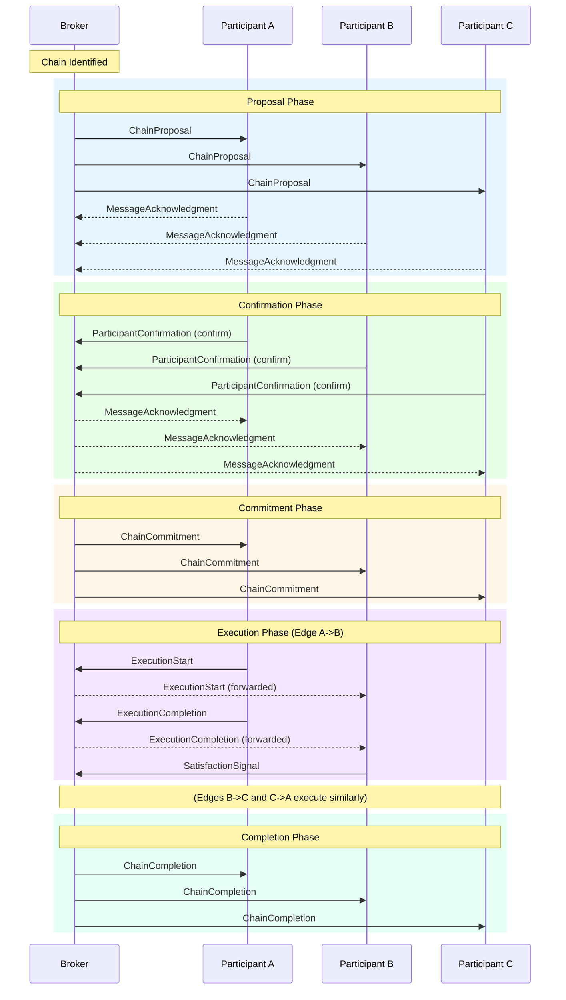
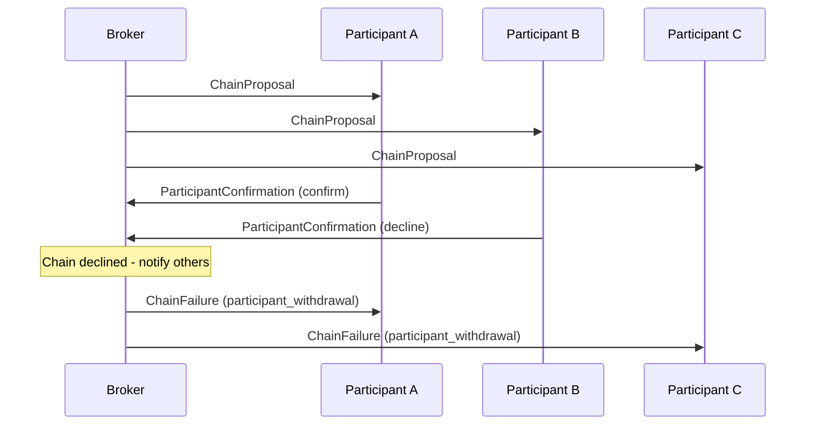
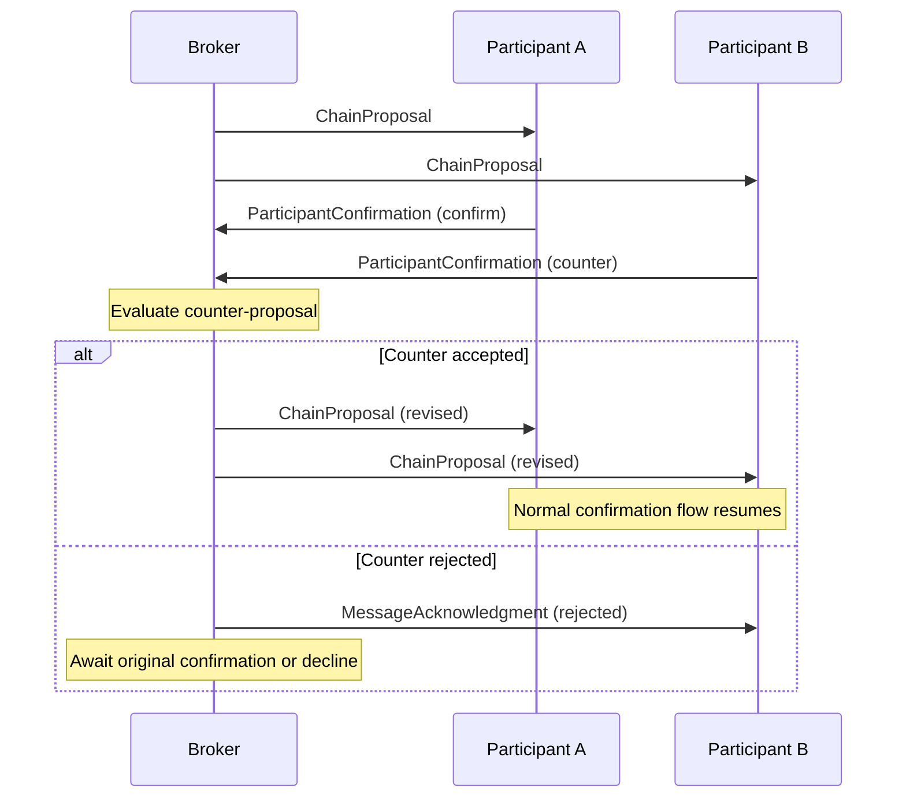
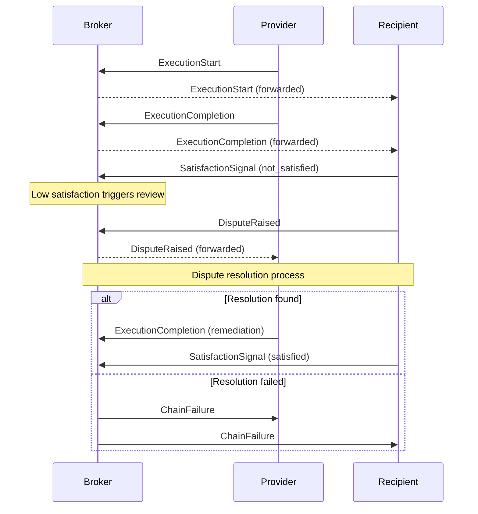

# SEP Message Protocol Specification

**Version:** 1.0.0
**Status:** Draft
**Last Updated:** 2026-02-05
**Schema Reference:** `schemas/protocol-messages.schema.json`

## Table of Contents

1. [Overview and Terminology](#1-overview-and-terminology)
2. [Message Header](#2-message-header)
3. [Message Types](#3-message-types)
4. [Message Sequencing](#4-message-sequencing)
5. [Idempotency and Deduplication](#5-idempotency-and-deduplication)
6. [Correlation and Conversation Tracking](#6-correlation-and-conversation-tracking)
7. [Versioning Strategy](#7-versioning-strategy)
8. [Security and Integrity](#8-security-and-integrity)
9. [Error Handling](#9-error-handling)

---

## 1. Overview and Terminology

### 1.1 Purpose

This specification defines the message formats and exchange patterns for communication between participants, agents, and brokers in the Surplus Exchange Protocol (SEP). The protocol enables the proposal, confirmation, execution, and completion of multi-party exchange chains without monetary intermediation.

### 1.2 Scope

This document covers:

- Message structure and validation requirements
- The eleven (11) defined message types and their semantics
- Message sequencing and state transitions
- Idempotency, correlation, and deduplication mechanisms
- Signature and integrity verification
- Error handling and rejection codes

This document does not cover:

- Transport layer protocols (assumed to be TLS-encrypted connections)
- Agent discovery and capability advertisement (see separate specification)
- Matching algorithm internals
- Trust metric calculations

### 1.3 Normative Language

The key words "MUST", "MUST NOT", "REQUIRED", "SHALL", "SHALL NOT", "SHOULD", "SHOULD NOT", "RECOMMENDED", "MAY", and "OPTIONAL" in this document are to be interpreted as described in [RFC 2119](https://www.ietf.org/rfc/rfc2119.txt).

### 1.4 Terminology

| Term | Definition |
|------|------------|
| **Chain** | A complete cycle of exchanges where each participant provides to one party and receives from another, forming a closed loop. |
| **Edge** | A single exchange within a chain, representing a provider delivering an offering to a recipient. |
| **Participant** | An entity (individual, organisation, or their agent) that can provide or receive offerings in an exchange. |
| **Broker** | An entity that facilitates chain discovery, proposal, and monitoring. |
| **Agent** | An automated system acting on behalf of a participant. |
| **Offering** | A capability, service, or good that a participant is willing to provide. |
| **Subjective Value Ledger** | A participant's personal record of exchanges, valued according to their own assessment rather than a shared currency. |

### 1.5 Message Format

All messages MUST be encoded as JSON objects conforming to [JSON Schema Draft 2020-12](https://json-schema.org/draft/2020-12/schema). Messages MUST be transmitted using UTF-8 encoding.

---

## 2. Message Header

### 2.1 Overview

All SEP protocol messages share a common header structure that provides identification, routing, timing, and integrity verification. The header fields enable message deduplication, conversation tracking, and security validation.

### 2.2 Required Fields

Every message MUST include the following header fields:

| Field | Type | Format | Description |
|-------|------|--------|-------------|
| `message_id` | string | UUID v4 | Unique identifier for this message |
| `message_type` | string | enum | Discriminator identifying the message type |
| `timestamp` | string | ISO 8601 date-time | When the message was created |
| `sender_id` | string | non-empty | Identifier of the sending entity |
| `protocol_version` | string | `major.minor` | SEP protocol version (e.g., "1.0") |

#### 2.2.1 message_id

The `message_id` field MUST be a valid UUID version 4 string. This identifier:

- MUST be unique across all messages from the sender
- MUST be used for idempotency checking (see [Section 5](#5-idempotency-and-deduplication))
- SHOULD be generated using a cryptographically secure random number generator

**Example:** `"f47ac10b-58cc-4372-a567-0e02b2c3d479"`

#### 2.2.2 message_type

The `message_type` field MUST be one of the eleven defined message types:

- `ChainProposal`
- `ParticipantConfirmation`
- `ChainCommitment`
- `ExecutionStart`
- `ExecutionCompletion`
- `SatisfactionSignal`
- `DisputeRaised`
- `ChainCompletion`
- `ChainFailure`
- `MessageAcknowledgment`
- `HealthCheck`

This field serves as the discriminator for message type routing.

#### 2.2.3 timestamp

The `timestamp` field MUST be an ISO 8601 date-time string including timezone information. Implementations SHOULD use UTC (indicated by the `Z` suffix).

**Example:** `"2026-02-05T14:30:00Z"`

#### 2.2.4 sender_id

The `sender_id` field MUST be a non-empty string identifying the sending participant, agent, or broker. The format of this identifier is implementation-specific but SHOULD be consistent within a deployment.

**Example:** `"participant-hartley-legal"` or `"broker-london-001"`

#### 2.2.5 protocol_version

The `protocol_version` field MUST follow the pattern `major.minor` where both components are non-negative integers.

**Example:** `"1.0"`

### 2.3 Optional Fields

The following header fields are OPTIONAL:

| Field | Type | Format | Description |
|-------|------|--------|-------------|
| `correlation_id` | string | any | Links related messages in a conversation or workflow |
| `reply_to` | string | UUID | Message ID this is a direct response to |
| `signature` | string | base64 | Cryptographic signature of message content |

#### 2.3.1 correlation_id

The `correlation_id` field MAY be included to link related messages across a conversation or workflow. When present:

- The value SHOULD be set to the `chain_id` for chain-related messages
- All messages relating to the same chain SHOULD use the same `correlation_id`
- Implementations MAY use this for message routing and logging

**Example:** `"chain-2026-02-05-abc123"`

#### 2.3.2 reply_to

The `reply_to` field SHOULD be included when a message is a direct response to another message. When present:

- The value MUST be the `message_id` of the message being responded to
- This creates an explicit parent-child relationship between messages
- Implementations SHOULD use this for conversation threading

**Example:** `"f47ac10b-58cc-4372-a567-0e02b2c3d479"`

#### 2.3.3 signature

The `signature` field SHOULD be included for messages requiring integrity verification. See [Section 8](#8-security-and-integrity) for detailed signature requirements.

### 2.4 Schema Reference

The complete header schema is defined in `schemas/protocol-messages.schema.json` under `$defs/messageHeader`.

---

## 3. Message Types

The SEP protocol defines eleven message types, organised into four categories:

1. **Chain Lifecycle Messages:** `ChainProposal`, `ChainCommitment`, `ChainCompletion`, `ChainFailure`
2. **Participant Response Messages:** `ParticipantConfirmation`, `SatisfactionSignal`, `DisputeRaised`
3. **Execution Messages:** `ExecutionStart`, `ExecutionCompletion`
4. **Infrastructure Messages:** `MessageAcknowledgment`, `HealthCheck`

### 3.1 ChainProposal

**Purpose:** Proposes a new exchange chain to potential participants. Sent by a broker or matching algorithm when a viable chain has been identified.

**Direction:** Broker/Algorithm -> Participants

**Required Fields:**

| Field | Type | Description |
|-------|------|-------------|
| `chain_id` | string | Unique identifier for this proposed chain |
| `edges` | array | The exchanges comprising this chain (minimum 2) |
| `timing` | object | Proposed timing constraints |
| `match_rationale` | object | Explanation of why this chain was proposed |

**Optional Fields:**

| Field | Type | Description |
|-------|------|-------------|
| `metadata` | object | Additional chain metadata |

#### 3.1.1 edges Array

Each edge in the `edges` array MUST contain:

| Field | Type | Description |
|-------|------|-------------|
| `edge_id` | string | Unique identifier for this edge within the chain |
| `provider_id` | string | Participant providing the offering |
| `recipient_id` | string | Participant receiving the offering |
| `offering_id` | string | Reference to the capability offering |
| `offering_summary` | string | Human-readable summary (max 500 characters) |

The `edges` array:

- MUST contain at least 2 edges (minimum for a valid cycle)
- MUST form a complete cycle where each participant appears as both provider and recipient exactly once
- SHOULD be ordered in the logical sequence of the chain

#### 3.1.2 timing Object

The `timing` object defines deadlines and scheduling:

| Field | Type | Description |
|-------|------|-------------|
| `confirmation_deadline` | date-time | When all confirmations must be received |
| `execution_window.start` | date | Earliest date execution can begin |
| `execution_window.end` | date | Latest date all execution must complete |
| `edge_schedules` | array | Per-edge timing constraints (OPTIONAL) |

#### 3.1.3 match_rationale Object

The `match_rationale` object explains the matching:

| Field | Type | Description |
|-------|------|-------------|
| `algorithm_version` | string | Version of matching algorithm |
| `match_score` | number | Confidence score (0.0 to 1.0) |
| `key_matches` | array | Human-readable match explanations |

#### 3.1.4 metadata Object (Optional)

| Field | Type | Description |
|-------|------|-------------|
| `proposed_by` | enum | One of: `algorithm`, `participant`, `broker` |
| `includes_physical_goods` | boolean | Whether logistics are required |
| `geographic_span` | array | Regions involved in the chain |

**Example:**

```json
{
  "message_id": "f47ac10b-58cc-4372-a567-0e02b2c3d479",
  "message_type": "ChainProposal",
  "timestamp": "2026-02-05T14:30:00Z",
  "sender_id": "broker-london-001",
  "protocol_version": "1.0",
  "chain_id": "chain-2026-02-05-abc123",
  "edges": [
    {
      "edge_id": "edge-001",
      "provider_id": "participant-hartley-legal",
      "recipient_id": "participant-brighton-catering",
      "offering_id": "offering-hartley-contract-review",
      "offering_summary": "Contract review and advisory (10 hours)"
    },
    {
      "edge_id": "edge-002",
      "provider_id": "participant-brighton-catering",
      "recipient_id": "participant-creative-solutions",
      "offering_id": "offering-brighton-corporate-event",
      "offering_summary": "Corporate catering for 50 people"
    },
    {
      "edge_id": "edge-003",
      "provider_id": "participant-creative-solutions",
      "recipient_id": "participant-hartley-legal",
      "offering_id": "offering-creative-brand-refresh",
      "offering_summary": "Brand identity refresh"
    }
  ],
  "timing": {
    "confirmation_deadline": "2026-02-08T18:00:00Z",
    "execution_window": {
      "start": "2026-02-12",
      "end": "2026-03-15"
    }
  },
  "match_rationale": {
    "algorithm_version": "1.2.0",
    "match_score": 0.89,
    "key_matches": [
      "Hartley Legal needs brand refresh; Creative Solutions offers design",
      "Brighton Catering needs legal review; Hartley offers legal services",
      "Creative Solutions has event; Brighton has spare catering capacity"
    ]
  }
}
```

### 3.2 ParticipantConfirmation

**Purpose:** A participant's response to a chain proposal. Can confirm, decline, or propose modifications.

**Direction:** Participant -> Broker

**Required Fields:**

| Field | Type | Description |
|-------|------|-------------|
| `chain_id` | string | Chain this confirmation relates to |
| `participant_id` | string | Identifier of the confirming participant |
| `decision` | enum | One of: `confirm`, `decline`, `counter` |

**Conditional Fields:**

| Field | Required When | Description |
|-------|---------------|-------------|
| `decline_reason` | `decision` = `decline` | Explanation for declining (max 1000 chars) |
| `counter_proposal` | `decision` = `counter` | Proposed modifications |

**Optional Fields:**

| Field | Type | Description |
|-------|------|-------------|
| `conditions` | array | Conditions attached to confirmation |

#### 3.2.1 decision Values

- **`confirm`**: Participant agrees to the proposal. MAY include conditions.
- **`decline`**: Participant rejects the proposal. MUST include `decline_reason`.
- **`counter`**: Participant proposes modifications. MUST include `counter_proposal`.

#### 3.2.2 conditions Array

When `decision` is `confirm`, participants MAY attach conditions:

- Conditions MUST be strings describing requirements
- Other participants MUST agree to conditions for commitment
- Conditions SHOULD be specific and verifiable

#### 3.2.3 counter_proposal Object

When `decision` is `counter`:

| Field | Type | Description |
|-------|------|-------------|
| `timing_adjustment` | object | Proposed timing changes |
| `edge_modifications` | array | Proposed edge changes |

**Example (Confirmation):**

```json
{
  "message_id": "7c9e6679-7425-40de-944b-e07fc1f90ae7",
  "message_type": "ParticipantConfirmation",
  "timestamp": "2026-02-06T11:45:00Z",
  "sender_id": "participant-hartley-legal",
  "protocol_version": "1.0",
  "reply_to": "f47ac10b-58cc-4372-a567-0e02b2c3d479",
  "correlation_id": "chain-2026-02-05-abc123",
  "chain_id": "chain-2026-02-05-abc123",
  "participant_id": "participant-hartley-legal",
  "decision": "confirm",
  "conditions": [
    "Contract documents must be provided at least 5 working days before deadline",
    "Review scope limited to employment agreements only"
  ]
}
```

**Example (Decline):**

```json
{
  "message_id": "8d0f7780-8536-51ef-a55c-f18fd2e91bf8",
  "message_type": "ParticipantConfirmation",
  "timestamp": "2026-02-06T14:00:00Z",
  "sender_id": "participant-example",
  "protocol_version": "1.0",
  "reply_to": "f47ac10b-58cc-4372-a567-0e02b2c3d479",
  "chain_id": "chain-2026-02-05-abc123",
  "participant_id": "participant-example",
  "decision": "decline",
  "decline_reason": "Capacity fully committed during proposed execution window"
}
```

### 3.3 ChainCommitment

**Purpose:** Notification that all participants have confirmed and the chain is now binding. Marks the transition from "confirming" to "committed" status.

**Direction:** Broker -> All Participants

**Required Fields:**

| Field | Type | Description |
|-------|------|-------------|
| `chain_id` | string | Chain that is now committed |
| `confirmed_edges` | array | All edges with confirmation timestamps |
| `final_timing` | object | Agreed timing after negotiation |
| `commitment_hash` | string | Cryptographic hash of committed state |

**Optional Fields:**

| Field | Type | Description |
|-------|------|-------------|
| `participants_summary` | array | Summary of each participant's role |

#### 3.3.1 confirmed_edges Array

Each confirmed edge MUST contain:

| Field | Type | Description |
|-------|------|-------------|
| `edge_id` | string | Reference to the edge |
| `provider_confirmed_at` | date-time | When provider confirmed |
| `recipient_confirmed_at` | date-time | When recipient confirmed |

#### 3.3.2 commitment_hash

The `commitment_hash` field:

- MUST follow the format `algorithm:hash` (e.g., `sha256:abc123...`)
- MUST be computed over a canonical representation of the committed chain state
- SHOULD use SHA-256 or stronger algorithm
- Enables participants to verify they received identical commitment information

**Example:**

```json
{
  "message_id": "550e8400-e29b-41d4-a716-446655440000",
  "message_type": "ChainCommitment",
  "timestamp": "2026-02-08T16:30:00Z",
  "sender_id": "broker-london-001",
  "protocol_version": "1.0",
  "correlation_id": "chain-2026-02-05-abc123",
  "chain_id": "chain-2026-02-05-abc123",
  "confirmed_edges": [
    {
      "edge_id": "edge-001",
      "provider_confirmed_at": "2026-02-06T11:45:00Z",
      "recipient_confirmed_at": "2026-02-07T09:20:00Z"
    }
  ],
  "final_timing": {
    "confirmation_deadline": "2026-02-08T18:00:00Z",
    "execution_window": {
      "start": "2026-02-12",
      "end": "2026-03-15"
    }
  },
  "commitment_hash": "sha256:a3f2b8c9d4e5f6a7b8c9d0e1f2a3b4c5d6e7f8a9b0c1d2e3f4a5b6c7d8e9f0a1",
  "participants_summary": [
    {
      "participant_id": "participant-hartley-legal",
      "provides_to": "participant-brighton-catering",
      "receives_from": "participant-creative-solutions"
    }
  ]
}
```

### 3.4 ExecutionStart

**Purpose:** Provider signals they have begun executing their edge of the exchange.

**Direction:** Provider -> Broker (and optionally Recipient)

**Required Fields:**

| Field | Type | Description |
|-------|------|-------------|
| `chain_id` | string | Chain this execution belongs to |
| `edge_id` | string | Edge being executed |
| `started_at` | date-time | When execution began |

**Optional Fields:**

| Field | Type | Description |
|-------|------|-------------|
| `expected_completion` | date | Estimated completion date |
| `notes` | string | Notes about execution plan (max 500 chars) |

**Validation:**

- The sender MUST be the provider for the specified edge
- The chain MUST be in "committed" or "executing" state
- The edge MUST not have already started

**Example:**

```json
{
  "message_id": "a1b2c3d4-e5f6-7890-abcd-ef1234567890",
  "message_type": "ExecutionStart",
  "timestamp": "2026-02-12T09:00:00Z",
  "sender_id": "participant-hartley-legal",
  "protocol_version": "1.0",
  "correlation_id": "chain-2026-02-05-abc123",
  "chain_id": "chain-2026-02-05-abc123",
  "edge_id": "edge-001",
  "started_at": "2026-02-12T09:00:00Z",
  "expected_completion": "2026-02-25",
  "notes": "Beginning contract review. Will provide initial feedback within one week."
}
```

### 3.5 ExecutionCompletion

**Purpose:** Provider signals they have completed delivery of their offering.

**Direction:** Provider -> Broker -> Recipient

**Required Fields:**

| Field | Type | Description |
|-------|------|-------------|
| `chain_id` | string | Chain this completion belongs to |
| `edge_id` | string | Edge that was completed |
| `completed_at` | date-time | When delivery was completed |

**Optional Fields:**

| Field | Type | Description |
|-------|------|-------------|
| `delivery_evidence` | object | Evidence supporting completion |
| `notes` | string | Additional notes (max 1000 chars) |

#### 3.5.1 delivery_evidence Object

| Field | Type | Description |
|-------|------|-------------|
| `evidence_type` | enum | One of: `document`, `confirmation`, `tracking`, `photo`, `other` |
| `description` | string | Human-readable description (max 1000 chars) |
| `attachments` | array | File attachments |

Each attachment contains:

| Field | Type | Description |
|-------|------|-------------|
| `filename` | string | Name of the file |
| `url` | string (URI) | URL to retrieve the attachment |
| `hash` | string | SHA-256 hash of file contents (OPTIONAL) |

**Example:**

```json
{
  "message_id": "6ba7b810-9dad-11d1-80b4-00c04fd430c8",
  "message_type": "ExecutionCompletion",
  "timestamp": "2026-02-25T17:30:00Z",
  "sender_id": "participant-hartley-legal",
  "protocol_version": "1.0",
  "correlation_id": "chain-2026-02-05-abc123",
  "chain_id": "chain-2026-02-05-abc123",
  "edge_id": "edge-001",
  "completed_at": "2026-02-25T17:30:00Z",
  "delivery_evidence": {
    "evidence_type": "document",
    "description": "Completed review of 4 employment contracts with annotations",
    "attachments": [
      {
        "filename": "contract-review-final.pdf",
        "url": "https://secure.example.com/deliveries/review.pdf",
        "hash": "sha256:e3b0c44298fc1c149afbf4c8996fb92427ae41e4649b934ca495991b7852b855"
      }
    ]
  },
  "notes": "Review completed 3 days ahead of schedule."
}
```

### 3.6 SatisfactionSignal

**Purpose:** Recipient's subjective assessment of the delivery quality. Core to the subjective value ledger concept.

**Direction:** Recipient -> Broker (and optionally Provider)

**Required Fields:**

| Field | Type | Description |
|-------|------|-------------|
| `chain_id` | string | Chain this signal relates to |
| `edge_id` | string | Edge being assessed |
| `signal` | enum | One of: `satisfied`, `partially_satisfied`, `not_satisfied` |

**Optional Fields:**

| Field | Type | Description |
|-------|------|-------------|
| `feedback` | string | Qualitative feedback (max 1000 chars) |
| `partial_satisfaction_details` | object | Details when `partially_satisfied` |

#### 3.6.1 signal Values

- **`satisfied`**: Delivery met or exceeded expectations. No further action required.
- **`partially_satisfied`**: Some aspects were good, others fell short. SHOULD include `partial_satisfaction_details`.
- **`not_satisfied`**: Delivery significantly below expectations. MAY trigger dispute process.

#### 3.6.2 partial_satisfaction_details Object

| Field | Type | Description |
|-------|------|-------------|
| `what_was_good` | string | Aspects meeting expectations (max 500 chars) |
| `what_was_missing` | string | Aspects falling short (max 500 chars) |
| `suggested_resolution` | string | What would achieve satisfaction (max 500 chars) |

**Example:**

```json
{
  "message_id": "6ba7b811-9dad-11d1-80b4-00c04fd430c8",
  "message_type": "SatisfactionSignal",
  "timestamp": "2026-02-26T10:15:00Z",
  "sender_id": "participant-brighton-catering",
  "protocol_version": "1.0",
  "reply_to": "6ba7b810-9dad-11d1-80b4-00c04fd430c8",
  "correlation_id": "chain-2026-02-05-abc123",
  "chain_id": "chain-2026-02-05-abc123",
  "edge_id": "edge-001",
  "signal": "satisfied",
  "feedback": "Excellent work. Thorough review delivered ahead of schedule."
}
```

### 3.7 DisputeRaised

**Purpose:** Initiates a formal dispute about an edge, triggering the dispute resolution process.

**Direction:** Participant -> Broker

**Required Fields:**

| Field | Type | Description |
|-------|------|-------------|
| `chain_id` | string | Chain containing the disputed edge |
| `edge_id` | string | Edge being disputed |
| `dispute_type` | enum | Category of dispute |
| `description` | string | Detailed description (max 2000 chars) |

**Optional Fields:**

| Field | Type | Description |
|-------|------|-------------|
| `evidence` | array | Evidence supporting the dispute |
| `requested_resolution` | string | Desired outcome (max 1000 chars) |
| `willing_to_mediate` | boolean | Open to third-party mediation (default: true) |

#### 3.7.1 dispute_type Values

| Value | Description |
|-------|-------------|
| `non_delivery` | Provider did not deliver anything |
| `partial_delivery` | Provider delivered only part of what was agreed |
| `quality_mismatch` | Delivery quality significantly below expectations |
| `timing_violation` | Delivery outside agreed window |
| `scope_dispute` | Disagreement about what was agreed |
| `other` | Other dispute type (describe in `description`) |

#### 3.7.2 evidence Array

Each evidence item contains:

| Field | Type | Description |
|-------|------|-------------|
| `evidence_type` | string | Category of evidence |
| `description` | string | Description of evidence |
| `url` | string (URI) | URL to access evidence (OPTIONAL) |

**Example:**

```json
{
  "message_id": "dispute-001-xyz",
  "message_type": "DisputeRaised",
  "timestamp": "2026-02-27T14:00:00Z",
  "sender_id": "participant-brighton-catering",
  "protocol_version": "1.0",
  "correlation_id": "chain-2026-02-05-abc123",
  "chain_id": "chain-2026-02-05-abc123",
  "edge_id": "edge-001",
  "dispute_type": "partial_delivery",
  "description": "Contract review covered only 2 of 3 contracts. Third contract not reviewed.",
  "evidence": [
    {
      "evidence_type": "document",
      "description": "Original offering specifying 3 contracts",
      "url": "https://files.example.com/original-offering.pdf"
    }
  ],
  "requested_resolution": "Complete review of third contract",
  "willing_to_mediate": true
}
```

### 3.8 ChainCompletion

**Purpose:** Notification that all edges have been satisfied and the chain is complete. Triggers trust metric updates.

**Direction:** Broker -> All Participants

**Required Fields:**

| Field | Type | Description |
|-------|------|-------------|
| `chain_id` | string | Chain that completed |
| `completed_at` | date-time | When the final edge was satisfied |
| `summary` | object | Summary statistics |

**Optional Fields:**

| Field | Type | Description |
|-------|------|-------------|
| `trust_updates` | array | Trust metric changes |

#### 3.8.1 summary Object

| Field | Type | Description |
|-------|------|-------------|
| `total_edges` | integer | Total edges in chain (minimum 2) |
| `satisfied_edges` | integer | Edges with `satisfied` signal |
| `partially_satisfied_edges` | integer | Edges with `partially_satisfied` signal |
| `execution_duration_days` | integer | Days from first start to final satisfaction |
| `within_schedule` | boolean | All edges completed within windows |

#### 3.8.2 trust_updates Array

Each update contains:

| Field | Type | Description |
|-------|------|-------------|
| `participant_id` | string | Participant affected |
| `update_type` | enum | One of: `positive`, `neutral`, `negative` |

**Example:**

```json
{
  "message_id": "complete-001-abc",
  "message_type": "ChainCompletion",
  "timestamp": "2026-03-10T12:00:00Z",
  "sender_id": "broker-london-001",
  "protocol_version": "1.0",
  "correlation_id": "chain-2026-02-05-abc123",
  "chain_id": "chain-2026-02-05-abc123",
  "completed_at": "2026-03-10T12:00:00Z",
  "summary": {
    "total_edges": 3,
    "satisfied_edges": 3,
    "partially_satisfied_edges": 0,
    "execution_duration_days": 26,
    "within_schedule": true
  },
  "trust_updates": [
    { "participant_id": "participant-hartley-legal", "update_type": "positive" },
    { "participant_id": "participant-brighton-catering", "update_type": "positive" },
    { "participant_id": "participant-creative-solutions", "update_type": "positive" }
  ]
}
```

### 3.9 ChainFailure

**Purpose:** Notification that a chain has failed, including compensation and resolution information.

**Direction:** Broker -> All Participants

**Required Fields:**

| Field | Type | Description |
|-------|------|-------------|
| `chain_id` | string | Chain that failed |
| `failed_at` | date-time | When failure was determined |
| `failure_reason` | enum | Category of failure |

**Optional Fields:**

| Field | Type | Description |
|-------|------|-------------|
| `failed_edge_id` | string | Edge that triggered failure |
| `affected_edges` | array | Status and compensation for each edge |
| `compensation_plan` | object | Compensation strategy |

#### 3.9.1 failure_reason Values

| Value | Description |
|-------|-------------|
| `edge_timeout` | Edge exceeded its deadline without completion |
| `edge_abandonment` | Provider abandoned execution |
| `unresolved_dispute` | Dispute could not be resolved |
| `participant_withdrawal` | Participant withdrew from chain |
| `cascade_failure` | Failure of one edge caused others to fail |
| `infrastructure_failure` | System or communication failure |
| `other` | Other reason |

#### 3.9.2 affected_edges Array

Each affected edge contains:

| Field | Type | Description |
|-------|------|-------------|
| `edge_id` | string | Reference to edge |
| `status_at_failure` | string | Edge status when chain failed |
| `compensation_action` | enum | One of: `completed_independently`, `reversed`, `compensated`, `none_required` |

#### 3.9.3 compensation_plan Object

| Field | Type | Description |
|-------|------|-------------|
| `strategy` | enum | One of: `restructure`, `partial_complete`, `full_unwind`, `settle_externally` |
| `actions` | array | Specific actions to be taken |
| `requires_approval` | boolean | Whether participants must approve |

**Example:**

```json
{
  "message_id": "failure-001-xyz",
  "message_type": "ChainFailure",
  "timestamp": "2026-03-01T09:00:00Z",
  "sender_id": "broker-london-001",
  "protocol_version": "1.0",
  "chain_id": "chain-456",
  "failed_at": "2026-03-01T09:00:00Z",
  "failure_reason": "edge_timeout",
  "failed_edge_id": "edge-002",
  "affected_edges": [
    {
      "edge_id": "edge-001",
      "status_at_failure": "SATISFIED",
      "compensation_action": "completed_independently"
    },
    {
      "edge_id": "edge-002",
      "status_at_failure": "IN_PROGRESS",
      "compensation_action": "compensated"
    }
  ],
  "compensation_plan": {
    "strategy": "partial_complete",
    "actions": [
      "Edge-001 completed successfully, no action needed",
      "Edge-002 provider receives reputation adjustment"
    ],
    "requires_approval": false
  }
}
```

### 3.10 MessageAcknowledgment

**Purpose:** Acknowledges receipt and processing of a message. Used for delivery confirmation and error reporting.

**Direction:** Recipient -> Sender

**Required Fields:**

| Field | Type | Description |
|-------|------|-------------|
| `original_message_id` | string (UUID) | ID of message being acknowledged |
| `received_at` | date-time | When original message was received |
| `processing_status` | enum | One of: `accepted`, `rejected`, `pending` |

**Conditional Fields:**

| Field | Required When | Description |
|-------|---------------|-------------|
| `rejection_reason` | `processing_status` = `rejected` | Human-readable explanation |
| `rejection_code` | `processing_status` = `rejected` | Standardised rejection code |

#### 3.10.1 processing_status Values

- **`accepted`**: Message was valid and processed successfully
- **`rejected`**: Message was invalid or could not be processed
- **`pending`**: Message received but processing is deferred

#### 3.10.2 rejection_code Values

See [Section 9](#9-error-handling) for detailed rejection code documentation.

**Example (Acceptance):**

```json
{
  "message_id": "ack-001-abc",
  "message_type": "MessageAcknowledgment",
  "timestamp": "2026-02-05T14:30:05Z",
  "sender_id": "participant-hartley-legal",
  "protocol_version": "1.0",
  "original_message_id": "f47ac10b-58cc-4372-a567-0e02b2c3d479",
  "received_at": "2026-02-05T14:30:02Z",
  "processing_status": "accepted"
}
```

**Example (Rejection):**

```json
{
  "message_id": "ack-002-def",
  "message_type": "MessageAcknowledgment",
  "timestamp": "2026-02-05T14:30:05Z",
  "sender_id": "broker-london-001",
  "protocol_version": "1.0",
  "original_message_id": "invalid-message-123",
  "received_at": "2026-02-05T14:30:02Z",
  "processing_status": "rejected",
  "rejection_reason": "Chain has already been committed",
  "rejection_code": "invalid_state_transition"
}
```

### 3.11 HealthCheck

**Purpose:** Periodic health check message for monitoring chain progress and identifying issues.

**Direction:** Monitor/Broker -> Participants (or internal)

**Required Fields:**

| Field | Type | Description |
|-------|------|-------------|
| `chain_id` | string | Chain being monitored |
| `check_type` | enum | One of: `scheduled`, `triggered`, `manual` |
| `status` | enum | One of: `healthy`, `warning`, `at_risk`, `failing` |

**Optional Fields:**

| Field | Type | Description |
|-------|------|-------------|
| `health_score` | number | Numeric health (0.0 = critical, 1.0 = perfect) |
| `edge_statuses` | array | Per-edge health status |
| `issues` | array | Identified issues |
| `recommendations` | array | Suggested actions |

#### 3.11.1 check_type Values

- **`scheduled`**: Regular periodic check
- **`triggered`**: Triggered by an event (e.g., missed deadline approaching)
- **`manual`**: Manually requested check

#### 3.11.2 status Values

| Value | Description |
|-------|-------------|
| `healthy` | All edges progressing normally |
| `warning` | Minor issues detected; attention recommended |
| `at_risk` | Significant issues; intervention likely needed |
| `failing` | Critical issues; chain likely to fail without intervention |

#### 3.11.3 edge_statuses Array

Each edge status contains:

| Field | Type | Description |
|-------|------|-------------|
| `edge_id` | string | Reference to edge |
| `status` | string | Current execution status |
| `progress_percent` | number | Estimated completion (0-100) |
| `on_schedule` | boolean | Whether edge is on track |

#### 3.11.4 issues Array

Each issue contains:

| Field | Type | Description |
|-------|------|-------------|
| `issue_type` | string | Category of issue |
| `severity` | enum | One of: `info`, `warning`, `critical` |
| `description` | string | Human-readable description |
| `affected_edge_id` | string | Related edge (OPTIONAL) |

**Example:**

```json
{
  "message_id": "health-001",
  "message_type": "HealthCheck",
  "timestamp": "2026-02-20T00:00:00Z",
  "sender_id": "monitor-001",
  "protocol_version": "1.0",
  "chain_id": "chain-2026-02-05-abc123",
  "check_type": "scheduled",
  "status": "warning",
  "health_score": 0.65,
  "edge_statuses": [
    {
      "edge_id": "edge-001",
      "status": "SATISFIED",
      "progress_percent": 100,
      "on_schedule": true
    },
    {
      "edge_id": "edge-002",
      "status": "IN_PROGRESS",
      "progress_percent": 40,
      "on_schedule": false
    }
  ],
  "issues": [
    {
      "issue_type": "schedule_delay",
      "severity": "warning",
      "description": "Edge-002 is 3 days behind schedule",
      "affected_edge_id": "edge-002"
    }
  ],
  "recommendations": [
    "Contact participant-B to verify execution progress",
    "Consider extending execution window if delay persists"
  ]
}
```

---

## 4. Message Sequencing

### 4.1 Overview

Messages in SEP follow defined sequences corresponding to the chain lifecycle. This section documents the typical message flows and valid state transitions.

### 4.2 Chain Lifecycle States

A chain progresses through the following states:

```
DRAFT -> PROPOSED -> CONFIRMING -> COMMITTED -> EXECUTING -> COMPLETED
                  \            \                         \
                   -> DECLINED  -> EXPIRED                -> FAILED
```

| State | Description |
|-------|-------------|
| `DRAFT` | Chain identified but not yet proposed |
| `PROPOSED` | ChainProposal sent to participants |
| `CONFIRMING` | Awaiting participant confirmations |
| `DECLINED` | One or more participants declined |
| `COMMITTED` | All participants confirmed; binding |
| `EXPIRED` | Confirmation deadline passed |
| `EXECUTING` | At least one edge has started |
| `COMPLETED` | All edges satisfied |
| `FAILED` | Chain could not complete |

### 4.3 Typical Message Sequence: Successful Chain

The following diagram shows the standard message flow for a successful three-participant chain:



### 4.4 Message Sequence: Declined Proposal



### 4.5 Message Sequence: Counter-Proposal Negotiation



### 4.6 Message Sequence: Execution with Dispute



### 4.7 Valid Message Transitions

The following table shows which message types are valid from each chain state:

| Current State | Valid Incoming Messages |
|---------------|------------------------|
| `PROPOSED` | `ParticipantConfirmation`, `MessageAcknowledgment` |
| `CONFIRMING` | `ParticipantConfirmation`, `MessageAcknowledgment` |
| `COMMITTED` | `ExecutionStart`, `HealthCheck` |
| `EXECUTING` | `ExecutionStart`, `ExecutionCompletion`, `SatisfactionSignal`, `DisputeRaised`, `HealthCheck` |
| Any state | `MessageAcknowledgment`, `HealthCheck` |

### 4.8 Timing Constraints

Implementations MUST enforce the following timing rules:

1. **Confirmation Deadline:** If all `ParticipantConfirmation` messages with `decision: confirm` are not received before `timing.confirmation_deadline`, the chain MUST transition to `EXPIRED` state.

2. **Execution Window:** `ExecutionStart` messages MUST NOT be accepted before `timing.execution_window.start` or after `timing.execution_window.end`.

3. **Edge Schedules:** If `timing.edge_schedules` is provided, individual edges MUST respect their `earliest_start` and `latest_completion` constraints.

4. **Message Ordering:** Within a single edge:
   - `ExecutionStart` MUST precede `ExecutionCompletion`
   - `ExecutionCompletion` MUST precede `SatisfactionSignal`
   - `DisputeRaised` MAY occur any time after `ExecutionStart`

---

## 5. Idempotency and Deduplication

### 5.1 Purpose

Message deduplication ensures that network issues, retries, or duplicate deliveries do not cause incorrect state transitions or duplicate processing.

### 5.2 Requirements

#### 5.2.1 Message ID Uniqueness

Senders MUST ensure that each `message_id` is globally unique. Implementations SHOULD use UUID v4 generated with a cryptographically secure random number generator.

#### 5.2.2 Receiver Deduplication

Receivers MUST implement deduplication based on `message_id`:

1. Receivers MUST maintain a record of processed message IDs
2. If a message with a previously-seen `message_id` is received, the receiver MUST NOT process it again
3. The receiver SHOULD return the same response as the original processing
4. The duplicate detection window MUST be at least 7 days
5. The duplicate detection window SHOULD be at least 30 days

#### 5.2.3 Idempotent Processing

Message handlers MUST be idempotent:

```typescript
// Example from src/protocol/message-handler.ts
async processMessage(message: ProtocolMessage): Promise<MessageProcessingResult> {
  // Idempotency check
  if (this.processedMessageIds.has(message.message_id)) {
    return {
      success: true,
      actions: [],
      // Return cached response if available
    };
  }

  // ... process message ...

  // Mark message as processed
  if (result.success) {
    this.processedMessageIds.add(message.message_id);
  }

  return result;
}
```

### 5.3 Implementation Guidance

#### 5.3.1 Storage Requirements

Implementations SHOULD store the following for each processed message:

| Field | Purpose |
|-------|---------|
| `message_id` | Primary lookup key |
| `received_at` | For expiration/cleanup |
| `processing_status` | To return on duplicate |
| `response_hash` | To verify consistent responses |

#### 5.3.2 Cleanup Strategy

Implementations MAY implement a cleanup strategy:

1. Messages older than the retention window MAY be removed
2. Removal SHOULD be gradual (e.g., batch deletion) to avoid performance impact
3. Before removal, implementations SHOULD verify the associated chain is in a terminal state (`COMPLETED`, `FAILED`, `DECLINED`, `EXPIRED`)

### 5.4 Sender Retry Behaviour

Senders SHOULD implement retry logic:

1. If no `MessageAcknowledgment` is received within a timeout, retry with the same `message_id`
2. Retry intervals SHOULD use exponential backoff
3. Maximum retry count SHOULD be configurable (recommended: 3-5 retries)
4. After maximum retries, senders SHOULD escalate or log the failure

---

## 6. Correlation and Conversation Tracking

### 6.1 Overview

SEP provides two mechanisms for linking related messages:

1. **`correlation_id`**: Groups messages belonging to the same conversation or workflow
2. **`reply_to`**: Creates explicit parent-child relationships between messages

### 6.2 correlation_id Usage

#### 6.2.1 Chain-Related Messages

For messages related to a specific chain, the `correlation_id` SHOULD be set to the `chain_id`:

```json
{
  "message_id": "new-message-uuid",
  "correlation_id": "chain-2026-02-05-abc123",
  "chain_id": "chain-2026-02-05-abc123"
}
```

This enables:
- Filtering all messages for a specific chain
- Logging and audit trails
- Debugging and troubleshooting

#### 6.2.2 Non-Chain Messages

For infrastructure messages not tied to a specific chain (e.g., capability advertisements, discovery), implementations MAY define their own correlation schemes.

### 6.3 reply_to Usage

#### 6.3.1 Direct Responses

The `reply_to` field SHOULD be used when a message is a direct response:

| Trigger Message | Response Message |
|-----------------|------------------|
| `ChainProposal` | `ParticipantConfirmation` |
| `ExecutionCompletion` | `SatisfactionSignal` |
| Any message | `MessageAcknowledgment` |

#### 6.3.2 Conversation Threading

Using `reply_to` enables reconstruction of conversation threads:

```
ChainProposal (msg-001)
├── ParticipantConfirmation (msg-002, reply_to: msg-001)
│   └── MessageAcknowledgment (msg-003, reply_to: msg-002)
├── ParticipantConfirmation (msg-004, reply_to: msg-001)
│   └── MessageAcknowledgment (msg-005, reply_to: msg-004)
└── ParticipantConfirmation (msg-006, reply_to: msg-001)
    └── MessageAcknowledgment (msg-007, reply_to: msg-006)
```

### 6.4 Implementation Requirements

1. Both fields are OPTIONAL in the message header
2. If `reply_to` is provided, it MUST be a valid UUID
3. If `reply_to` references an unknown message, receivers SHOULD NOT reject the message
4. Implementations SHOULD log correlation information for debugging
5. Implementations MAY use correlation for message routing

---

## 7. Versioning Strategy

### 7.1 Version Format

The `protocol_version` field uses semantic versioning with `major.minor` format:

- **Major version**: Incremented for breaking changes
- **Minor version**: Incremented for backwards-compatible additions

**Examples:** `"1.0"`, `"1.1"`, `"2.0"`

### 7.2 Compatibility Rules

#### 7.2.1 Same Major Version

Implementations with the same major version MUST be interoperable:

- A v1.1 sender MUST be able to communicate with a v1.0 receiver
- A v1.0 sender MUST be able to communicate with a v1.1 receiver
- Receivers MUST ignore unknown fields (forward compatibility)
- Senders MUST NOT require new fields when communicating with older versions

#### 7.2.2 Different Major Versions

Implementations with different major versions MAY NOT be interoperable:

- A v2.0 message MAY be rejected by a v1.x receiver
- Brokers MAY implement version translation
- Breaking changes MUST increment the major version

### 7.3 Version Negotiation

#### 7.3.1 Version Advertisement

Participants and brokers SHOULD advertise supported protocol versions during discovery (see capability advertisement specification).

#### 7.3.2 Message Version Selection

When sending a message, the sender SHOULD:

1. Use the highest mutually-supported version
2. Fall back to a lower version if the receiver does not support the sender's preferred version
3. Reject communication if no compatible version exists

### 7.4 Deprecation Process

When deprecating protocol features:

1. Features MUST be marked as deprecated in at least one minor release before removal
2. Deprecated features MUST continue to work for at least 6 months
3. Breaking changes (major version increment) SHOULD be communicated at least 3 months in advance
4. Migration guides SHOULD be provided for major version changes

### 7.5 Version Validation

Receivers MUST validate the `protocol_version` field:

1. Version MUST match the pattern `^\d+\.\d+$`
2. If the major version is not supported, receivers MUST reject with `invalid_format`
3. If the minor version is higher than supported, receivers SHOULD process with best effort

---

## 8. Security and Integrity

### 8.1 Overview

Message integrity and authenticity are critical for trust in the SEP protocol. This section defines the signature mechanism and verification requirements.

### 8.2 Signature Requirements

#### 8.2.1 When to Sign

The following messages MUST be signed:

- `ParticipantConfirmation` with `decision: confirm`
- `ChainCommitment`
- `ExecutionCompletion`
- `SatisfactionSignal`
- `DisputeRaised`

The following messages SHOULD be signed:

- All other message types for defence in depth

#### 8.2.2 Signature Algorithm

Implementations MUST support Ed25519 signatures. Implementations MAY additionally support:

- Ed448
- ECDSA with P-256 or P-384

The signature algorithm SHOULD be indicated in the signature format (see below).

### 8.3 Signature Generation

#### 8.3.1 Canonical Message Format

Before signing, messages MUST be converted to canonical form:

1. Remove the `signature` field if present
2. Serialise to JSON with keys sorted alphabetically
3. Use no whitespace (compact form)
4. Use UTF-8 encoding

#### 8.3.2 Signature Format

The `signature` field MUST use the format:

```
algorithm:base64_encoded_signature
```

**Examples:**
- `"ed25519:base64signature=="`
- `"ecdsa-p256:base64signature=="`

#### 8.3.3 Signing Process

```
1. canonical_json = canonicalise(message_without_signature)
2. signature_bytes = sign(canonical_json, private_key)
3. signature_field = algorithm + ":" + base64_encode(signature_bytes)
```

### 8.4 Signature Verification

#### 8.4.1 Verification Process

Receivers MUST verify signatures when present:

```
1. Extract algorithm and signature from signature field
2. Remove signature field from message
3. canonical_json = canonicalise(message)
4. public_key = lookup_key(sender_id)
5. valid = verify(canonical_json, signature_bytes, public_key)
```

#### 8.4.2 Verification Failure

If signature verification fails:

1. The message MUST be rejected
2. A `MessageAcknowledgment` with `processing_status: rejected` and `rejection_code: unauthorized` MUST be sent
3. The failure SHOULD be logged with details

### 8.5 Key Management

#### 8.5.1 Key Distribution

Public keys for signature verification SHOULD be distributed via:

- Participant capability advertisements
- A trusted key directory
- Out-of-band secure exchange

#### 8.5.2 Key Rotation

Implementations MUST support key rotation:

1. New keys SHOULD be announced before old keys are retired
2. A transition period SHOULD allow either key to be valid
3. Messages SHOULD indicate which key was used (via key ID in signature or separate field)

### 8.6 Transport Security

In addition to message-level signatures:

1. All message transport MUST use TLS 1.2 or higher
2. TLS 1.3 is RECOMMENDED
3. Certificate validation MUST be performed
4. Self-signed certificates SHOULD NOT be accepted in production

### 8.7 Commitment Hash

The `commitment_hash` in `ChainCommitment` messages provides an additional integrity check:

1. All participants can independently compute the hash
2. Hash mismatch indicates tampering or transmission error
3. Participants SHOULD verify the hash matches their understanding of the commitment

Hash computation:

```
1. Create canonical representation of committed chain:
   - chain_id
   - confirmed_edges (sorted by edge_id)
   - final_timing
2. hash = SHA-256(canonical_representation)
3. commitment_hash = "sha256:" + hex_encode(hash)
```

---

## 9. Error Handling

### 9.1 Overview

Error handling in SEP uses `MessageAcknowledgment` messages with `processing_status: rejected` to communicate failures. Standardised rejection codes enable automated error handling.

### 9.2 Rejection Codes

| Code | Description | Recommended Action |
|------|-------------|-------------------|
| `invalid_format` | Message does not conform to schema | Fix message format and resend |
| `invalid_chain_id` | Referenced chain does not exist | Verify chain_id is correct |
| `invalid_participant` | Sender not authorised for this action | Verify sender_id and permissions |
| `invalid_state_transition` | Action not valid in current chain state | Check chain state before retrying |
| `expired` | Message received after relevant deadline | No retry; deadline has passed |
| `duplicate` | Message with this ID already processed | No action; original was processed |
| `unauthorized` | Signature verification failed or unauthorised | Verify signature and credentials |
| `other` | Other error (see rejection_reason) | Check rejection_reason for details |

### 9.3 Error Responses

#### 9.3.1 invalid_format

Returned when the message does not conform to the JSON schema:

```json
{
  "message_type": "MessageAcknowledgment",
  "original_message_id": "malformed-msg-123",
  "received_at": "2026-02-05T14:30:02Z",
  "processing_status": "rejected",
  "rejection_code": "invalid_format",
  "rejection_reason": "Missing required field: chain_id"
}
```

**Sender action:** Review the message against the schema, fix the error, and resend with a new `message_id`.

#### 9.3.2 invalid_chain_id

Returned when the referenced chain does not exist:

```json
{
  "message_type": "MessageAcknowledgment",
  "original_message_id": "msg-with-bad-chain",
  "processing_status": "rejected",
  "rejection_code": "invalid_chain_id",
  "rejection_reason": "Chain 'chain-nonexistent' not found"
}
```

**Sender action:** Verify the chain_id. The chain may have been deleted, expired, or never existed.

#### 9.3.3 invalid_participant

Returned when the sender is not authorised:

```json
{
  "message_type": "MessageAcknowledgment",
  "original_message_id": "msg-from-wrong-sender",
  "processing_status": "rejected",
  "rejection_code": "invalid_participant",
  "rejection_reason": "Sender 'participant-X' is not a member of chain 'chain-123'"
}
```

**Sender action:** Verify the sender_id matches an authorised participant for the action.

#### 9.3.4 invalid_state_transition

Returned when the action is not valid for the current state:

```json
{
  "message_type": "MessageAcknowledgment",
  "original_message_id": "premature-execution-start",
  "processing_status": "rejected",
  "rejection_code": "invalid_state_transition",
  "rejection_reason": "Cannot start execution: chain is in CONFIRMING state, expected COMMITTED"
}
```

**Sender action:** Check the current chain state. The expected preconditions may not yet be met.

#### 9.3.5 expired

Returned when a deadline has passed:

```json
{
  "message_type": "MessageAcknowledgment",
  "original_message_id": "late-confirmation",
  "processing_status": "rejected",
  "rejection_code": "expired",
  "rejection_reason": "Confirmation deadline was 2026-02-08T18:00:00Z; message received at 2026-02-09T10:00:00Z"
}
```

**Sender action:** No retry possible. The deadline has passed.

#### 9.3.6 duplicate

Returned when the message ID has already been processed:

```json
{
  "message_type": "MessageAcknowledgment",
  "original_message_id": "already-processed-msg",
  "processing_status": "rejected",
  "rejection_code": "duplicate",
  "rejection_reason": "Message already processed at 2026-02-05T14:30:00Z"
}
```

**Sender action:** No action needed; the original message was successfully processed.

#### 9.3.7 unauthorized

Returned when signature verification fails:

```json
{
  "message_type": "MessageAcknowledgment",
  "original_message_id": "bad-signature-msg",
  "processing_status": "rejected",
  "rejection_code": "unauthorized",
  "rejection_reason": "Signature verification failed for sender 'participant-A'"
}
```

**Sender action:** Verify the signing key and process. Check for message tampering.

### 9.4 Pending Status

The `pending` status indicates deferred processing:

```json
{
  "message_type": "MessageAcknowledgment",
  "original_message_id": "queued-msg",
  "received_at": "2026-02-05T14:30:02Z",
  "processing_status": "pending"
}
```

When a message is marked pending:

1. The message has been received and validated
2. Processing is deferred (e.g., awaiting other confirmations)
3. A subsequent acknowledgment with `accepted` or `rejected` SHOULD be sent when processing completes

### 9.5 Error Recovery

#### 9.5.1 Transient Errors

For transient errors (network issues, temporary unavailability):

1. Retry with the same `message_id`
2. Use exponential backoff
3. Maximum retry duration SHOULD be configurable

#### 9.5.2 Permanent Errors

For permanent errors (`invalid_format`, `invalid_chain_id`, `expired`):

1. Do not retry the same message
2. Fix the underlying issue
3. Send a new message with a new `message_id` (if applicable)

#### 9.5.3 Escalation

If errors cannot be resolved automatically:

1. Log the error with full context
2. Alert appropriate personnel
3. Consider human intervention or dispute resolution

---

## Appendices

### Appendix A: Schema Reference

The complete JSON Schema for all message types is available at:

- File: `schemas/protocol-messages.schema.json`
- URI: `https://surplus-exchange-protocol.org/schemas/protocol-messages.schema.json`

### Appendix B: Example Messages

Complete example messages are available in the `examples/messages/` directory:

- `chain-proposal.json` - ChainProposal example
- `participant-confirmation.json` - ParticipantConfirmation example
- `chain-commitment.json` - ChainCommitment example
- `execution-completion.json` - ExecutionCompletion example
- `satisfaction-signal.json` - SatisfactionSignal example

### Appendix C: TypeScript Reference Implementation

A reference implementation of the message handler is available at:

- File: `src/protocol/message-handler.ts`

This implementation demonstrates:

- Message validation
- Idempotency checking
- State machine integration
- Error handling

### Appendix D: Change Log

| Version | Date | Changes |
|---------|------|---------|
| 1.0.0 | 2026-02-05 | Initial specification |

---

## References

1. [RFC 2119](https://www.ietf.org/rfc/rfc2119.txt) - Key words for use in RFCs to Indicate Requirement Levels
2. [JSON Schema Draft 2020-12](https://json-schema.org/draft/2020-12/schema) - JSON Schema specification
3. [RFC 4122](https://www.ietf.org/rfc/rfc4122.txt) - Universally Unique Identifier (UUID)
4. [ISO 8601](https://www.iso.org/iso-8601-date-and-time-format.html) - Date and time format
5. [Ed25519](https://ed25519.cr.yp.to/) - High-speed high-security signatures
